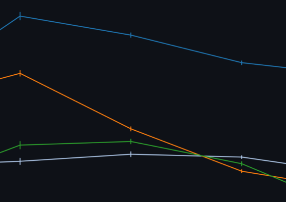

# How to Cite MAWA

## Methods
Recommended Text for Methods section, based on default settings:

### Multi-axial Gating
Multiplex cell datasets collected from Halo returned dataframes containing spatial coordinates of each cell in the image, and florescence levels of the markers measured in this study. Marker-combinations were constructed by selecting ranges of florescence levels for pre-selected marker types to represent sub-phenotypes. The combinations and ranges of markers created using the multi-axial gating tool can be seen in Figure X. 

### Phenotyper
For the collected cells, marker labels were assigned as either positive presence or negative presence based on a threshold of florescence for the given marker. Thresholding of markers was determined by [a. Multi-axial gating techniques][b. Automatic Thresholding Techniques]. Species names were assigned to each cell based on the combinations of positive markers for a given cell. For example, if the cell was identified as being positive for markers CD8, VIM and M2, then the species name assigned was 'CD8+ VIM+ M2+'. The phenotype was then assigned by (you choose):
1. as a copy of the species name.
2. as an instance of one of the positive markers in the species name.
3. as a custom name provided by the researchers. For a full table of the naming conventions, please see the Figure X.

### Spatial-Interaction Tool
*In Prep*

### Neighborhood Profiles
Cell densities were calculated by finding the per-phenotype counts of cells surrounding each cell in the dataset divided by the area of the annuli surrounding concentric radii around each of those cells. Spatial UMAP methods were performed using the *umap* package. 

## Citation
Weisman, Andrew; Smith, Dante. (2023). multiplex-analysis-web-apps. GitHub. https://github.com/ncats/multiplex-analysis-web-apps

## References
1. Baras, A. (2021). SpatialUMAP. GitHub. https://github.com/BarasLab/SpatialUMAP  
1. Giraldo, N. A., Berry, S., Becht, E., Ates, D., Schenk, K. M., Engle, E. L., Green, B., Ngyuen, P., Soni, A., Stein, J. E., Succaria, F., Ogurtsova, A., Xu, H., Gottardo, R., Anders, R. A., Lipson, E. J., Danilova, L., Baras, A. S., & Taube, J. M. (2021). Spatial UMAP and image cytometry for topographic immuno-oncology biomarker discovery. Cancer immunology research, 9(11), 1262-1269.  
1. McInnes, L. (2023). umap. GitHub. https://github.com/lmcinnes/umap
1. McInnes, L, Healy, J, UMAP: Uniform Manifold Approximation and Projection for Dimension Reduction, ArXiv e-prints 1802.03426, 2018
1. Windhager, J., Zanotelli, V.R.T., Schulz, D., Meyer, L., Michelle, D., Bodenmiller, B., Eling, N. An end-to-end workflow for multiplexed image processing and analysis. Nature Protocols 18, 3565–3613 (2023). https://doi.org/10.1038/s41596-023-00881-0
