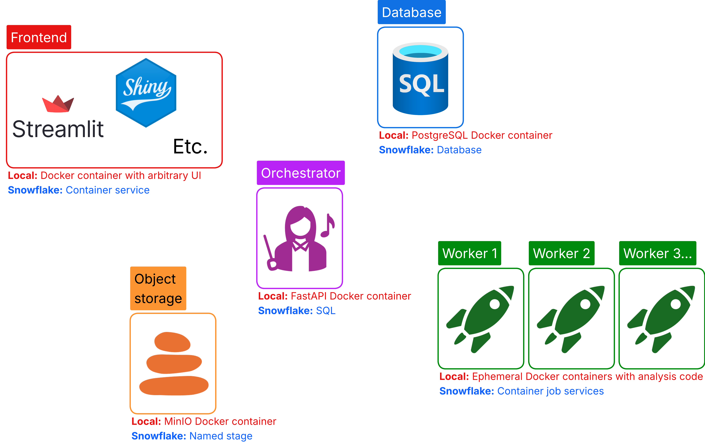
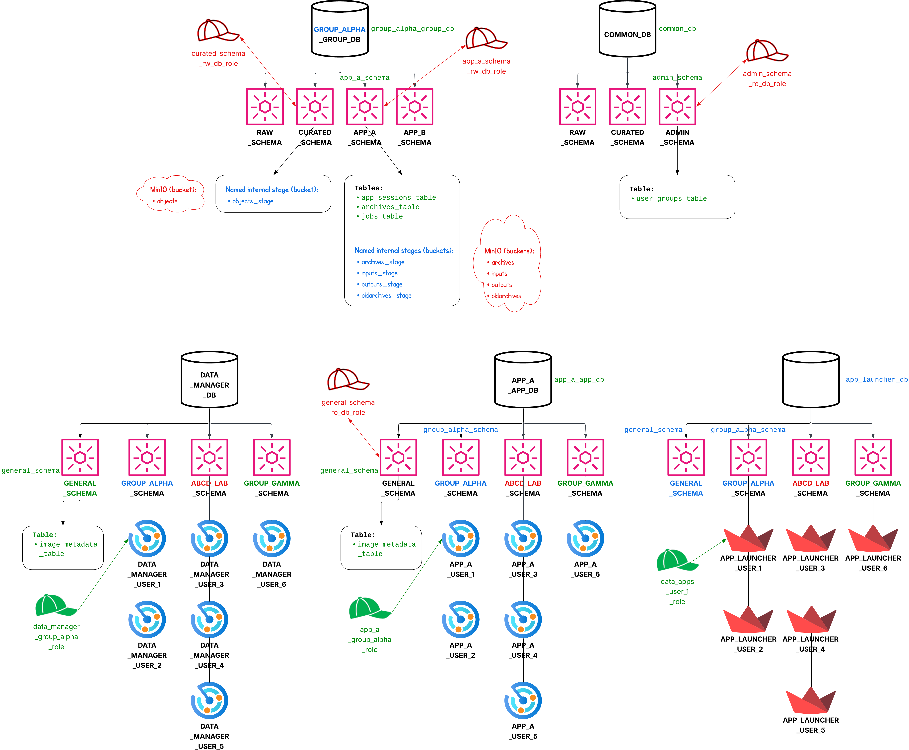

# Full Stack MAWA

## General how-to

### 1. Modify the codebase

Full-stack framework-specific files are located in `source/framework`. App-specific files (including an example `generate_results.py` file) are located in `source`.

Framework files should be modified only as truly necessary. App files can be modified freely.

### 2. Build the images

Build the `frontend`, `orchestrator`, and `data_manager` images using:

* `git clone git@github.com:ncats/multiplex-analysis-web-apps.git`.
* `cd multiplex-analysis-web-apps`
* `git checkout full-stack`.
* Ensure the clone contains the file `foundry_transforms_lib_python-0.881.0.tar.gz` in a `temp_vendor` subdirectory (not present in the repository by default).
* E.g., `ENV_NAME=leandro-robert ENV_PY_VER=3.12 DATE=2025-11-24 BUILD_VER=04 docker compose build`.
  * Unless you're already running on AMD64, include `--platform=linux/amd64` if you want to be able to use the same image on Snowflake (which we do). For testing locally on a Mac, this should work but should be a bit slower. Alternatively, you can leave off this extra argument for testing on a Mac, but know that the image will need to be rebuilt with the argument so that it works on Snowpark Container Services.

The other two images (`postgres` and `minio`) should be pulled when the multi-container app is launched, below.

### 3. Run the app locally

* E.g., `ENV_NAME=leandro-robert ENV_PY_VER=3.12 DATE=2025-11-24 BUILD_VER=04 docker compose up`.
* To launch MAWA, go to: http://localhost:8501.
* To launch the data manager, go to: http://localhost:8502.

### 4. Simultaneous build/run

* E.g., `ENV_NAME=leandro-robert ENV_PY_VER=3.12 DATE=2025-11-24 BUILD_VER=04 docker compose up --build`.

### 5. Shut down the container

After shutting down the app using the in-app sidebar button or `ctrl-c` in the terminal, run, e.g., `ENV_NAME=leandro-robert ENV_PY_VER=3.12 DATE=2025-11-24 BUILD_VER=04 docker compose down`.

### 6. Tag and push the images to Docker Hub

**Note: NCI IT is currently in the process of giving us an NCI Docker Hub account to use.**

E.g.:

```bash
ENV_NAME=leandro-robert
DATE=2025-11-24
BUILD_VER=04
IMAGE_TAG=${DATE}-v${BUILD_VER}-${ENV_NAME}-env
docker tag postgres:15 andrewweisman/mawa-postgres:$IMAGE_TAG && docker push andrewweisman/mawa-postgres:$IMAGE_TAG
docker tag minio/minio:RELEASE.2025-09-07T16-13-09Z-cpuv1 andrewweisman/mawa-minio:$IMAGE_TAG && docker push andrewweisman/mawa-minio:$IMAGE_TAG
docker tag orchestrator:$IMAGE_TAG andrewweisman/mawa-orchestrator:$IMAGE_TAG && docker push andrewweisman/mawa-orchestrator:$IMAGE_TAG
docker tag frontend:$IMAGE_TAG andrewweisman/mawa-frontend:$IMAGE_TAG && docker push andrewweisman/mawa-frontend:$IMAGE_TAG
docker tag mawa-data-manager:$IMAGE_TAG andrewweisman/mawa-data-manager:$IMAGE_TAG && docker push andrewweisman/mawa-data-manager:$IMAGE_TAG
```

The images in this example are located at https://hub.docker.com/u/andrewweisman.

### 7. Update the image metadata table

For this, see [the instructions here](deploy/docker/update_image_metadata.md).

### 8. Deploy to Snowflake

In general, in this section below, make the following sample substitutions, including in `deploy/snowflake/deploy.sql`:

  * `group_alpha` --> `cil`
  * `app_a` --> `mawa`
  * `App A` --> `Multiplex Analysis Web Apps`
  * `user_1` --> `aweisman`
  * `frontend` --> `mawa-frontend`
  * `data-manager` --> `mawa-data-manager`
  * `latest` --> `2025-11-24-v04-leandro-robert-env`

`user_1` can become anything; it does not need to match the Snowflake username. All that matters is that the username match what is in the `user_groups` table and the real Snowflake username is used at the botton of `deploy.sql`. **To keep this ID short (since there is an object character limit), we should use the format `<first-initial><last-name>`, e.g., `aweisman`.** This means that the combination of the app shortname and username (including a connecting underscore) should be at most 23 characters long since the object name can be no more than 63 characters: `XXXXX_YYYYYYYYYYYYYYYYY_frontend_28vcpu_240gib_19x_compute_pool`.

In addition, ensure you have stepped through enough of `deploy/snowflake/deploy.sql` for the relevant parts of these instructions. E.g., ensure you have gotten to the step of creating an image repository before you upload an image to the image repository below. Notes to execute the following are directly noted in the `deploy/snowflake/deploy.sql` script, so if you start stepping through that script, you can just reference the details below when you get there. I.e., you should be jumping back and forth between `deploy/snowflake/deploy.sql` and the instructions in this section.

Push the MAWA frontend and the data manager to Snowflake. Note that if the Snowflake deployment changes, we need to use its name in place of `nihnci-eval`:

```bash
ENV_NAME=leandro-robert
DATE=2025-11-24
BUILD_VER=04
IMAGE_TAG=${DATE}-v${BUILD_VER}-${ENV_NAME}-env
docker tag andrewweisman/mawa-frontend:$IMAGE_TAG nihnci-eval.registry.snowflakecomputing.com/app_a_app_db/general_schema/image_repository/mawa-frontend:$IMAGE_TAG
docker tag andrewweisman/mawa-data-manager:$IMAGE_TAG nihnci-eval.registry.snowflakecomputing.com/dmgr_db/general_schema/image_repository/mawa-data-manager:$IMAGE_TAG
snow spcs image-registry login --role accountadmin
docker push nihnci-eval.registry.snowflakecomputing.com/app_a_app_db/general_schema/image_repository/mawa-frontend:$IMAGE_TAG
docker push nihnci-eval.registry.snowflakecomputing.com/dmgr_db/general_schema/image_repository/mawa-data-manager:$IMAGE_TAG
```

Update the tables corresponding to the two images pushed above and potentially new users added in the user-specific versions of `deploy.sql` from https://github.com/CBIIT/snowflake-user-setup:

* `app_a_app_db.general_schema.image_metadata_table` --> see example [here](#common-development-workflow-from-local-to-snowflake)
* `dmgr_db.general_schema.image_metadata_table` --> see example [here](#common-development-workflow-from-local-to-snowflake)
* `common_db.admin_schema.user_groups_table` (Use the same as you use for `user_1`, which again can be anything.)

Push required files to the relevant stages from the GitHub clone:

```bash
snow sql --connection eval3 --role accountadmin  # Works for Andrew since he has the "eval3" Snowflake connection already set up. If you're not Andrew, install the Snowflake CLI (https://docs.snowflake.com/en/developer-guide/snowflake-cli/installation/installation#label-snowcli-install-linux-package-managers) and set up your connection to our Snowflake deployment.
> PUT file://deploy/snowflake/frontend_service_spec.yaml @app_a_app_db.general_schema.general_stage OVERWRITE=TRUE;
> PUT file://deploy/snowflake/worker_service_spec.yaml @app_a_app_db.general_schema.general_stage OVERWRITE=TRUE;
> PUT file://deploy/snowflake/launcher.py @app_launcher_db.general_schema.general_stage AUTO_COMPRESS=FALSE OVERWRITE=TRUE;
> PUT file://deploy/snowflake/environment.yml @app_launcher_db.general_schema.general_stage AUTO_COMPRESS=FALSE OVERWRITE=TRUE;
> PUT file://data_manager/snowflake_service_spec.yaml @dmgr_db.general_schema.general_stage OVERWRITE=TRUE;
```

Step through `deploy/snowflake/deploy.sql`.

As you add new services to Snowflake, please update the file `service_modification.sql` in the GitHub repository `git@github.com:CBIIT/snowflake-user-setup.git` so the services can be modified easily in the future.

## Additional notes

### Testing external loading of archives created on NIDAP

* Place archive `.zip` files (e.g., from the `output` dataset on NIDAP) from NIDAP into the `oldarchives` bucket.
* Use the "Data Import and Export" page to load these archives (don't forget to subsequently use the sidebar to actually load the sessions into the session state instead of only extracting the `.zip` files).
* Press through all the pages and ensure there are no errors at any point, **including at the bottom of each page**.
* Record somewhere which archive you tried as well as the tag for the containers so we know which containers were used for the testing.
* Testing notes:
  * For loading archives created on NIDAP, we cannot use a Mac since we require amd64-compiled libraries (`.tar.gz` file) which are incompatible with arm64-based Mac.
  * For general testing, we are fine using a Mac; everything should work probably even without any emulation.
  * For prod, we need to ensure we test on amd64 architecture.

### To use different environments

We have multiple environments available corresponding to those that got regularly rebuilt by Maestro on NIDAP:

* environment-ana-20240814_to_20241219-compatible.yml --> `ana-older`: Should work for all of Ana's previous archives. Note that Leandro's environment works for Ana's oldest archive actually.
* environment-ana-20250605-compatible.yml --> `ana-latest`: Should work for Ana's latest archive.
* environment-leandro-compatible.yml --> `leandro-robert`: Should work for all of Leandro's (and Robert's once confirmed) archives. Not the most up-to-date packages as these are based on some of Leandro's original archives to ensure compatibility with those.
* environment-gmb-20240628_to_20240701-compatible.yml --> `gmb-earliest`
* environment-gmb-20240917_to_20241003-compatible.yml --> `gmb-latest`
* environment-dceg-compatible.yml --> `dceg`

As of roughly Nov. 2025, even with pinned version of packages in a `.yml` file, `micromamba` is no longer able to resolve our environment (hangs indefinitely), at least with the settings at the top of the `.yml` files. In fact, unpinning all versions of packages and removing the bottom half of the packages picks up Python 3.9.18, which is old and we know we can do better (e.g., 3.12.9), e.g, the leandro-robert environment. In lieu of addressing this comprehensively now (I started to do this in `environment/environment-no_pins.yml`), we are instead solving from specific already-solved packages so there is no need for online environment solving at all. We are doing this by replacing the `.yml` files with an *explicit* lockfile and a frozen pip requirements file for each environment. All environment files will be present in `source/environment`. Here are example steps to perform this:

```bash
# From inside a running frontend image in Docker with name "xxxx", save from active environment.
micromamba env export --explicit > leandro-robert.lock
python -m pip freeze --exclude-editable | sed -E '/(file:|^@|feedstock_root|build_artifacts)/d' | grep -v "^foundry\|^tables-api==\|^transforms-container-ops-python==" > requirements-leandro-robert.txt

# Copy those files to the codebase.
docker cp xxxx:/app/leandro-robert.lock /home/andrew/repos/multiplex-analysis-web-apps/source/environment/
docker cp xxxx:/app/requirements-leandro-robert.txt /home/andrew/repos/multiplex-analysis-web-apps/source/environment/
```

Call docker compose as usual (first closing down the previous container network using `... docker compose down`) with something like the following so that the two environment-related variables are passed through:

```bash
ENV_NAME=leandro-robert ENV_PY_VER=3.12 DATE=2025-11-24 BUILD_VER=04 docker compose build
```

Here is what the environment-related Dockerfile looks like:

```dockerfile
# New environment setup.
COPY source/environment/${ENV_NAME}.lock .
COPY source/environment/requirements-${ENV_NAME}.txt .
RUN micromamba install -y --file ${ENV_NAME}.lock
RUN micromamba run python -m pip install -r requirements-${ENV_NAME}.txt
RUN micromamba clean --all --yes
COPY --chown=mambauser:mambauser temp_vendor/foundry_transforms_lib_python-0.881.0.tar.gz .
RUN tar -xzvf foundry_transforms_lib_python-0.881.0.tar.gz -C /opt/conda/lib/python${ENV_PY_VER}/site-packages/ && rm foundry_transforms_lib_python-0.881.0.tar.gz

# This replaces the **OLD** environment setup:
COPY source/environment/environment-${ENV_NAME}.yml .
RUN micromamba install -y --file environment-${ENV_NAME}.yml
RUN micromamba clean --all --yes
COPY --chown=mambauser:mambauser temp_vendor/foundry_transforms_lib_python-0.881.0.tar.gz .
RUN tar -xzvf foundry_transforms_lib_python-0.881.0.tar.gz -C /opt/conda/lib/python${ENV_PY_VER}/site-packages/ && rm foundry_transforms_lib_python-0.881.0.tar.gz
```

### How to add a new deployment in general, e.g., Snowflake

1. Add setup `deploy.sql` script `deploy/snowflake`.
1. Add orchestration functionality (`source/framework/snowflake_orchestrator.py`) to mimic that in `docker_orchestrator/main.py`.
    * If the orchestrator is not a separate container (like `snowflake_orchestrator.py`), it should be treated as such to preserve modularity. E.g., no usage of global variables such as via `streamlit` or `os.getenv()`.
1. Add "snowflake" branches in `platform_abstraction.py`.
1. Step through lines in the setup `deploy.sql` script in `deploy/snowflake`.

Note that the only existing code that is modified is `platform_abstraction.py`.

### Links

* [Codebase](https://github.com/ncats/multiplex-analysis-web-apps/tree/full-stack)
* This is [all MAWA user data](<https://axleinfo-my.sharepoint.com/:f:/r/personal/andrew_weisman_axleinfo_com/Documents/NIH/NIDAP migration/user_data_backup?e=5%3af5b9a4743b3a4ad48260a466f31d1555&sharingv2=true&fromShare=true&at=9>) (input and output datasets) as of 10/1/25. This includes the foundry_transforms_lib_python-0.881.0.tar.gz file.
* [User data locations on NIDAP](<https://axleinfo-my.sharepoint.com/:x:/r/personal/andrew_weisman_axleinfo_com/Documents/NIH/NIDAP migration/users.xlsx?d=wcf7286526ae547a9b5abc51d33ba7ff9&e=4%3afbf01da7919942748e988c4218f8d591&sharingv2=true&fromShare=true&at=9>)
* [Diagrams](https://lucid.app/lucidchart/da710fee-56ce-4fa3-9d07-d9a4a97e6f60/edit)

### Common development workflow from local to Snowflake

Bash:

```bash
ENV_NAME=leandro-robert
DATE=2025-11-24
BUILD_VER=04
IMAGE_TAG=${DATE}-v${BUILD_VER}-${ENV_NAME}-env
docker compose build
docker tag orchestrator:$IMAGE_TAG andrewweisman/mawa-orchestrator:$IMAGE_TAG && docker push andrewweisman/mawa-orchestrator:$IMAGE_TAG
docker tag frontend:$IMAGE_TAG andrewweisman/mawa-frontend:$IMAGE_TAG && docker push andrewweisman/mawa-frontend:$IMAGE_TAG
docker tag mawa-data-manager:$IMAGE_TAG andrewweisman/mawa-data-manager:$IMAGE_TAG && docker push andrewweisman/mawa-data-manager:$IMAGE_TAG
docker tag postgres:15 andrewweisman/mawa-postgres:$IMAGE_TAG && docker push andrewweisman/mawa-postgres:$IMAGE_TAG
docker tag minio/minio:RELEASE.2025-09-07T16-13-09Z-cpuv1 andrewweisman/mawa-minio:$IMAGE_TAG && docker push andrewweisman/mawa-minio:$IMAGE_TAG
docker tag andrewweisman/mawa-frontend:$IMAGE_TAG nihnci-eval.registry.snowflakecomputing.com/mawa_app_db/general_schema/image_repository/mawa-frontend:$IMAGE_TAG
docker tag andrewweisman/mawa-data-manager:$IMAGE_TAG nihnci-eval.registry.snowflakecomputing.com/dmgr_db/general_schema/image_repository/mawa-data-manager:$IMAGE_TAG
snow spcs image-registry login --role accountadmin
docker push nihnci-eval.registry.snowflakecomputing.com/mawa_app_db/general_schema/image_repository/mawa-frontend:$IMAGE_TAG
docker push nihnci-eval.registry.snowflakecomputing.com/dmgr_db/general_schema/image_repository/mawa-data-manager:$IMAGE_TAG
echo $IMAGE_TAG
git rev-parse HEAD
```

Snowflake SQL:

```sql
insert into mawa_app_db.general_schema.image_metadata_table (image_id, name, tag, git_commit, environment_yaml_file, archive_compatibility_id, who_added) values 
('sha256:50d9492c8c022ef8e1d03a4a1ba631f12d8d92a2756d6304bcd825cf0b4f576a', 'mawa-frontend', '2025-11-24-v04-leandro-robert-env', '3da40cf2eaa6e80b0baf847b809aa2ab3f59f059', 'environment-leandro-compatible.yml', 'leandro-robert', 'andrewweisman');

insert into dmgr_db.general_schema.image_metadata_table (image_id, name, tag, git_commit, environment_yaml_file, who_added) values 
('sha256:0fb08033b700a7f9ddd1630cdc7f25b3487274362cab02f72628290d78420516', 'mawa-data-manager', '2025-11-24-v04-leandro-robert-env', '3da40cf2eaa6e80b0baf847b809aa2ab3f59f059', 'environment-leandro-compatible.yml', 'andrewweisman');

-- 1vcpu_6gib_1x
ALTER SERVICE mawa_app_db.cil_schema.mawa_robert_cheng_frontend_1vcpu_6gib_1x_service
FROM @mawa_app_db.general_schema.general_stage SPECIFICATION_TEMPLATE_FILE='frontend_service_spec.yaml'
USING (
  APP_SHORTNAME => 'mawa',
  APP_TITLE => '"Multiplex Analysis Web Apps"',
  MONITOR_JOBS_REFRESH_INTERVAL_SECONDS => 5,
  SNOWFLAKE_USER => '"robert_cheng"',
  COMPUTE_RESOURCE => '"1vcpu_6gib_1x"',
  ALL_COMPUTE_RESOURCES => '"1vcpu_6gib_1x 3vcpu_13gib_2x 6vcpu_28gib_4x 6vcpu_58gib_5x 14vcpu_58gib_7x 28vcpu_116gib_14x 28vcpu_240gib_19x"',
  IMAGE => '"/mawa_app_db/general_schema/image_repository/mawa-frontend:2025-11-24-v04-leandro-robert-env"',  -- updated
  SNOWFLAKE_WAREHOUSE => '"mawa_robert_cheng_xs_warehouse"',
  MOUNTPATH => '"/tmp/mawa"',
  MEMORY => '6Gi',
  CPU => 1,
  IMAGE_NAME => '"mawa-frontend"',
  IMAGE_TAG => '"2025-11-24-v04-leandro-robert-env"'  -- updated
);
alter service mawa_app_db.cil_schema.mawa_robert_cheng_frontend_1vcpu_6gib_1x_service suspend;
alter compute pool mawa_robert_cheng_frontend_1vcpu_6gib_1x_compute_pool suspend;

-- Repeat for (such as in scratch-2025-11-09.sql):
-- 3vcpu_13gib_2x
-- 6vcpu_28gib_4x
-- 6vcpu_58gib_5x
-- 14vcpu_58gib_7x
-- 28vcpu_116gib_14x
-- 28vcpu_240gib_19x

ALTER SERVICE dmgr_db.cil_schema.dmgr_robert_cheng_xs_service
FROM @dmgr_db.general_schema.general_stage SPECIFICATION_TEMPLATE_FILE='snowflake_service_spec.yaml'
USING ( APP_SHORTNAME=>'dmgr', APP_TITLE=>' "Data Manager" ', SNOWFLAKE_USER=>' "robert_cheng" ', COMPUTE_RESOURCE=>' "1vcpu_6gib_1x" ', ALL_COMPUTE_RESOURCES=>' "1vcpu_6gib_1x 3vcpu_13gib_2x 6vcpu_28gib_4x 6vcpu_58gib_5x 14vcpu_58gib_7x 28vcpu_116gib_14x 28vcpu_240gib_19x" ', IMAGE=>' "/dmgr_db/general_schema/image_repository/mawa-data-manager:2025-11-24-v04-leandro-robert-env" ', SNOWFLAKE_WAREHOUSE=>' "dmgr_robert_cheng_xs_warehouse" ', MOUNTPATH=>' "/tmp/dmgr" ', MEMORY=>'6Gi', CPU=>1, IMAGE_NAME=>' "mawa-data-manager" ', IMAGE_TAG=>' "2025-11-24-v04-leandro-robert-env" ' );
alter service dmgr_db.cil_schema.dmgr_robert_cheng_xs_service suspend;
alter compute pool dmgr_robert_cheng_xs_compute_pool suspend;
```

**See also the file `service_modification.sql` in the GitHub repository `git@github.com:CBIIT/snowflake-user-setup.git` for a running list of services to update with code to run in batch!**

### Miscellaneous

* Reference for buckets/stages:
  * archives --> for new archives generated by the new framework
  * inputs --> these hold data that are needed as inputs for an ephemeral job
  * outputs --> these hold results from ephemeral jobs
  * oldarchives --> temporary bucket to hold archives from NIDAP (like the "output" dataset on NIDAP)
  * objects --> this holds user input files (like the "input" dataset on NIDAP)
  The "input" and "output" directories are purely local folders existing in the containers and have nothing to do with the "input" and "output" buckets, which have to do with asynchronous job inputs/outputs. The local "input" and "output" directories are not buckets (Docker) or stages (Snowflake) like everything above.
* To access any of these buckets, go to http://127.0.0.1:9001. Username=`minioadmin` and password=`minioadmin123`.
* To use full stack MAWA, place input .csv etc. files into the `objects` bucket. These files are then accessible in the app via the Data Import and Export page as usual (previously on NIDAP).
* At some point we want to implement multi-arch builds using `docker buildx`.
* Asynchronous execution is not yet fully implemented. For guidance, see `generate_results.py`.
* Per the comment in the last line of `deploy.sql`: That line is the one place (the argument of USER) that the real Snowflake username must be used. Other instances of "user_1" can be anything, as long as they have an entry in the user_groups table so we know which group they should be accessing. E.g., user_1_alpha should correspond to the group_alpha group and user_1_beta should correspond to the group_beta group in the user_groups table. Then this script will create e.g. (1) data_apps_user_1_alpha_role and assign it to user_1 and (2) data_apps_user_1_beta_role and assign it to user_1. Then, user_1 in Snowsight can select either role to access the app/data for either group.

### Diagrams (as of 11/9/25)

Containers in the app:



Here is the ideal organization scheme for the app:


