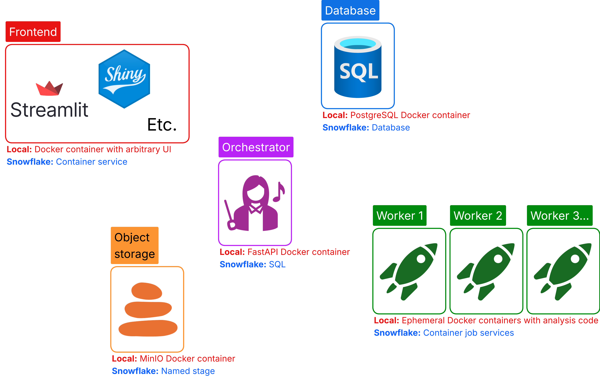
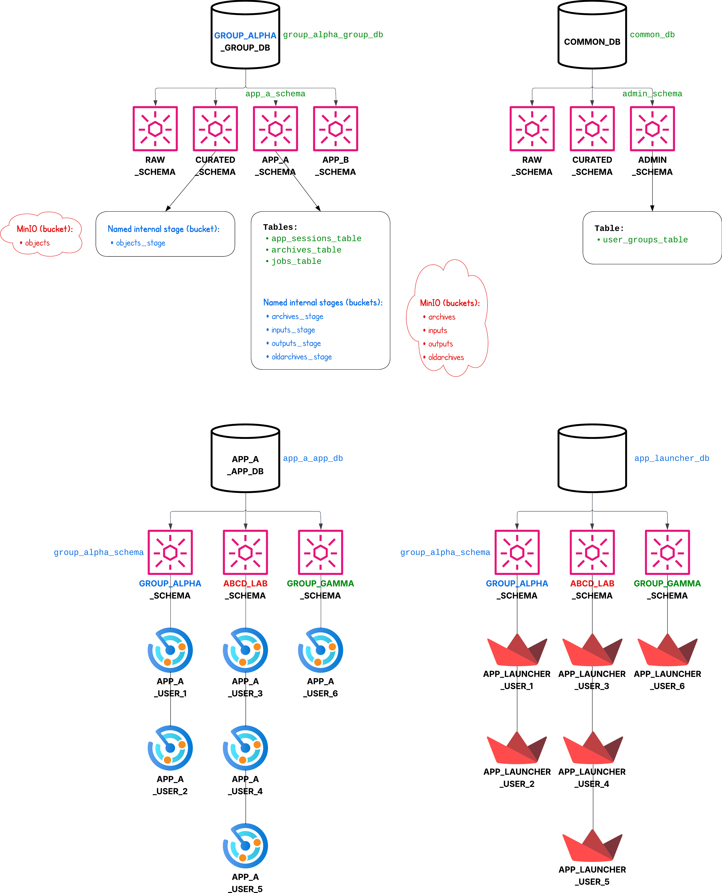

# Full Stack MAWA

## Build instructions

Build the `frontend` and `orchestrator` images using:

* `git clone git@github.com:ncats/multiplex-analysis-web-apps.git`.
* `cd multiplex-analysis-web-apps`
* `git checkout full-stack`.
* Ensure the clone contains the file `foundry_transforms_lib_python-0.881.0.tar.gz` in a `temp_vendor` subdirectory (not present in the repository by default).
* E.g., `IMAGE_TAG=2025-10-20-03 docker compose build`.
  * Unless you're already running on AMD64, include `--platform=linux/amd64` if you want to be able to use the same image on Snowflake (which we do). For testing locally on a Mac, this should work but should be a bit slower. Alternatively, you can leave off this extra argument for testing on a Mac, but know that the image will need to be rebuilt with the argument so that it works on Snowpark Container Services.

The other two images (`postgres` and `minio`) should be pulled when the multi-container app is launched, below.

## Run instructions

* E.g., `IMAGE_TAG=2025-10-20-03 docker compose up`.
* In a web browser go to http://localhost:8501.

## Simultaneous build/run

* E.g., `IMAGE_TAG=2025-10-20-03 docker compose up --build`.

## Notes

* Reference for buckets/stages:
  * archives --> for new archives generated by the new framework
  * inputs --> these hold data that are needed as inputs for an ephemeral job
  * outputs --> these hold results from ephemeral jobs
  * oldarchives --> temporary bucket to hold archives from NIDAP (like the "output" dataset on NIDAP)
  * objects --> this holds user input files (like the "input" dataset on NIDAP)

  The "input" and "output" directories are purely local folders existing in the containers and have nothing to do with the "input" and "output" buckets, which have to do with asynchronous job inputs/outputs. The local "input" and "output" directories are not buckets (Docker) or stages (Snowflake) like everything above.
* To access any of these buckets, go to http://127.0.0.1:9001. Username=`minioadmin` and password=`minioadmin123`.
* To use full stack MAWA, place input .csv etc. files into the `objects` bucket. These files are then accessible in the app via the Data Import and Export page as usual (previously on NIDAP).
* Testing:
  * Place archive `.zip` files (e.g., from the `output` dataset on NIDAP) from NIDAP into the `oldarchives` bucket.
  * Use the "Data Import and Export" page to load these archives (don't forget to subsequently use the sidebar to actually load the sessions into the session state instead of only extracting the `.zip` files).
  * Press through all the pages and ensure there are no errors at any point.
  * Record somewhere which archive you tried as well as the tag for the containers so we know which containers were used for the testing.
  * Testing notes:
    * For loading archives created on NIDAP, we cannot use a Mac since we require amd64-compiled libraries (`.tar.gz file`) which are incompatible with arm64-based Mac.
    * For general testing, we are fine using a Mac; everything should work probably even without any emulation.
    * For prod, we need to ensure we test on amd64 architecture.
* At some point we want to implement multi-arch builds using `docker buildx`.
* Here are the containers in the app:
  
* Here is the ideal organization scheme for the app:
  
