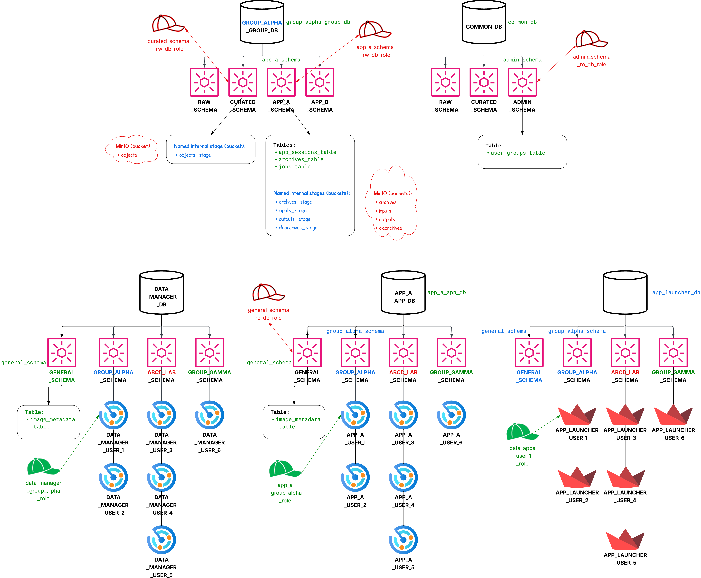

# Full Stack MAWA

## To-do

* Add instructions for setting up the data manager once we've created it.

## General how-to

### 1. Modify the codebase

Full-stack framework-specific files are located in `source/framework`. App-specific files (including an example `generate_results.py` file) are located in `source`.

Framework files should be modified only as truly necessary. App files can be modified freely.

### 2. Build the images

Build the `frontend` and `orchestrator` images using:

* `git clone git@github.com:ncats/multiplex-analysis-web-apps.git`.
* `cd multiplex-analysis-web-apps`
* `git checkout full-stack`.
* Ensure the clone contains the file `foundry_transforms_lib_python-0.881.0.tar.gz` in a `temp_vendor` subdirectory (not present in the repository by default).
* E.g., `IMAGE_TAG=2025-10-24-v03-gmb-earliest docker compose build`.
  * Unless you're already running on AMD64, include `--platform=linux/amd64` if you want to be able to use the same image on Snowflake (which we do). For testing locally on a Mac, this should work but should be a bit slower. Alternatively, you can leave off this extra argument for testing on a Mac, but know that the image will need to be rebuilt with the argument so that it works on Snowpark Container Services.

The other two images (`postgres` and `minio`) should be pulled when the multi-container app is launched, below.

### 3. Run the app locally

* E.g., `IMAGE_TAG=2025-10-24-v03-gmb-earliest docker compose up`.
* In a web browser go to http://localhost:8501.

### 4. Simultaneous build/run

* E.g., `IMAGE_TAG=2025-10-24-v03-gmb-earliest docker compose up --build`.

### 5. Shut down the container

After shutting down the app using the in-app sidebar button or `ctrl-c` in the terminal, run, e.g., `IMAGE_TAG=2025-10-24-v03-gmb-earliest docker compose down`.

### 6. Tag and push the images to Docker Hub

E.g.:

```bash
IMAGE_TAG=2025-10-24-v03-gmb-earliest
docker tag postgres:15 andrewweisman/mawa-postgres:$IMAGE_TAG && docker push andrewweisman/mawa-postgres:$IMAGE_TAG
docker tag minio/minio:RELEASE.2025-09-07T16-13-09Z-cpuv1 andrewweisman/mawa-minio:$IMAGE_TAG && docker push andrewweisman/mawa-minio:$IMAGE_TAG
docker tag orchestrator:$IMAGE_TAG andrewweisman/mawa-orchestrator:$IMAGE_TAG && docker push andrewweisman/mawa-orchestrator:$IMAGE_TAG
docker tag frontend:$IMAGE_TAG andrewweisman/mawa-frontend:$IMAGE_TAG && docker push andrewweisman/mawa-frontend:$IMAGE_TAG
```

The images in this example are located at https://hub.docker.com/u/andrewweisman.

### 7. Update the image metadata table

With the database up, add to `app_a_app_db.general_schema.image_metadata_table` a record corresponding to the `andrewweisman/mawa-frontend:$IMAGE_TAG` image just pushed to Docker Hub.

Maybe in the future, add steps/fields for the other three images? For now, the above is likely sufficient.

### 8. Update the user groups table

With the database up, add to `common_db.admin_schema.user_groups_table` a record corresponding to the user who will use the app.

### 9. Deploy to Snowflake

In general, in this section below, make the following sample substitutions, including in `deploy/snowflake/deploy.sql`:

  * `group_alpha` --> `cil`
  * `app_a` --> `mawa`
  * `App A` --> `Multiplex Analysis Web Apps`
  * `user_1` --> `aweisman`

`user_1` can become anything; it does not need to match the Snowflake username. All that matters is that the username match what is in the `user_groups` table and the real Snowflake username is used at the botton of `deploy.sql`. **To keep this ID short (since there is an object character limit), we should use the format `<first-initial><last-name>`, e.g., `aweisman`.** This means that the combination of the app shortname and username (including a connecting underscore) should be at most 23 characters long since the object name can be no more than 63 characters: `XXXXX_YYYYYYYYYYYYYYYYY_frontend_28vcpu_240gib_19x_compute_pool`.

In addition, ensure you have stepped through enough of `deploy/snowflake/deploy.sql` for the relevant parts of these instructions. E.g., ensure you have gotten to the step of creating an image repository before you upload an image to the image repository below. Notes to execute the following are directly noted in the `deploy/snowflake/deploy.sql` script, so if you start stepping through that script, you can just reference the details below when you get there. I.e., you should be jumping back and forth between `deploy/snowflake/deploy.sql` and the instructions in this section.

Push the frontend image to Snowflake. Note that if the Snowflake deployment changes, we need to use its name in place of `nihnci-eval`:

```bash
IMAGE_TAG=2025-10-24-v03-gmb-earliest
docker tag andrewweisman/mawa-frontend:$IMAGE_TAG nihnci-eval.registry.snowflakecomputing.com/app_a_app_db/general_schema/image_repository/mawa-frontend:$IMAGE_TAG
snow spcs image-registry login --role accountadmin
docker push nihnci-eval.registry.snowflakecomputing.com/app_a_app_db/general_schema/image_repository/mawa-frontend:$IMAGE_TAG
```

Update the tables `app_a_app_db.general_schema.image_metadata_table` and `common_db.admin_schema.user_groups_table` as we do locally (above). Note that for the latter table, you should use the same as you use for `user_1`, which again can be anything.

Push required files to the relevant stages from the GitHub clone:

```bash
snow sql --connection eval3 --role accountadmin  # Works for Andrew since he has the "eval3" Snowflake connection already set up. If you're not Andrew, install the Snowflake CLI (https://docs.snowflake.com/en/developer-guide/snowflake-cli/installation/installation#label-snowcli-install-linux-package-managers) and set up your connection to our Snowflake deployment.
> PUT file://deploy/snowflake/frontend_service_spec.yaml @app_a_app_db.general_schema.general_stage;
> PUT file://deploy/snowflake/worker_service_spec.yaml @app_a_app_db.general_schema.general_stage;
> PUT file://deploy/snowflake/launcher.py @app_launcher_db.general_schema.general_stage;
```

Step through `deploy/snowflake/deploy.sql`.

## Additional notes

### Testing external loading of archives created on NIDAP

* Place archive `.zip` files (e.g., from the `output` dataset on NIDAP) from NIDAP into the `oldarchives` bucket.
* Use the "Data Import and Export" page to load these archives (don't forget to subsequently use the sidebar to actually load the sessions into the session state instead of only extracting the `.zip` files).
* Press through all the pages and ensure there are no errors at any point, **including at the bottom of each page**.
* Record somewhere which archive you tried as well as the tag for the containers so we know which containers were used for the testing.
* Testing notes:
  * For loading archives created on NIDAP, we cannot use a Mac since we require amd64-compiled libraries (`.tar.gz` file) which are incompatible with arm64-based Mac.
  * For general testing, we are fine using a Mac; everything should work probably even without any emulation.
  * For prod, we need to ensure we test on amd64 architecture.

### To use a different environment

Figure out the new environment, and then create a new corresponding `.yml` file, e.g., `source/environment-ana.yml`. Confirm it builds successfully locally, ensure necessary packages import, etc. Make sure that environment is solid.

Modify the three lines (see commented lines) in `streamlit/Dockerfile` as, e.g.:

```dockerfile
# Use Micromamba as base image
# In the future, pin this version to ensure consistency.
FROM mambaorg/micromamba:latest

# Set the working directory in the container
WORKDIR /app

# Copy ONLY the environment file first (changes less frequently)
# COPY source/environment.yml .
COPY source/environment-ana.yml .

# Create conda environment from environment.yml
# RUN micromamba install -y -f environment.yml && micromamba clean --all --yes
RUN micromamba install -y -f environment-ana.yml && micromamba clean --all --yes

# "Install" foundry_transforms_lib_python by unpacking it into site-packages.
COPY temp_vendor/foundry_transforms_lib_python-0.881.0.tar.gz .
# RUN tar -xzvf foundry_transforms_lib_python-0.881.0.tar.gz -C /opt/conda/lib/python3.12/site-packages/ && rm foundry_transforms_lib_python-0.881.0.tar.gz
RUN tar -xzvf foundry_transforms_lib_python-0.881.0.tar.gz -C /opt/conda/lib/python3.9/site-packages/ && rm foundry_transforms_lib_python-0.881.0.tar.gz

# Copy source files to the container
COPY source/ .

# Copy .git to get commit hash
COPY .git .git

# Expose the port that Streamlit runs on
EXPOSE 8501

# Run the Streamlit app when the container starts
CMD ["streamlit", "run", "app.py", "--server.address", "0.0.0.0", "--server.port", "8501"]
```

Build a new image using e.g. `IMAGE_TAG=2025-10-24-v03-gmb-earliest docker compose build`.

Ensure the previously run app is fully shut down using e.g. `IMAGE_TAG=2025-10-24-v03-gmb-earliest docker compose down`.

Run using e.g. `IMAGE_TAG=2025-10-24-v03-gmb-earliest docker compose up`.

Did similar dependency resolution for Ana's last archive. Now have three different environments with the following tags on Andrew's laptop:

* environment-ana-20240814_to_20241219-compatible.yml --> `ana-older`: Should work for all of Ana's previous archives. Note that Leandro's environment works for Ana's oldest archive actually.
* environment-ana-20250605-compatible.yml --> `ana-latest`: Should work for Ana's latest archive.
* environment-leandro-compatible.yml --> `leandro`: Should work for all of Leandro's (and Robert's once confirmed) archives. Not the most up-to-date packages as these are based on some of Leandro's original archives to ensure compatibility with those.
* environment-gmb-20240628_to_20240701-compatible.yml --> `gmb-earliest`
* environment-gmb-20240917_to_20241003-compatible.yml --> `gmb-latest`
* environment-dceg-compatible.yml --> `dceg`

### Notes

* Reference for buckets/stages:
  * archives --> for new archives generated by the new framework
  * inputs --> these hold data that are needed as inputs for an ephemeral job
  * outputs --> these hold results from ephemeral jobs
  * oldarchives --> temporary bucket to hold archives from NIDAP (like the "output" dataset on NIDAP)
  * objects --> this holds user input files (like the "input" dataset on NIDAP)
  The "input" and "output" directories are purely local folders existing in the containers and have nothing to do with the "input" and "output" buckets, which have to do with asynchronous job inputs/outputs. The local "input" and "output" directories are not buckets (Docker) or stages (Snowflake) like everything above.
* To access any of these buckets, go to http://127.0.0.1:9001. Username=`minioadmin` and password=`minioadmin123`.
* To use full stack MAWA, place input .csv etc. files into the `objects` bucket. These files are then accessible in the app via the Data Import and Export page as usual (previously on NIDAP).
* At some point we want to implement multi-arch builds using `docker buildx`.
* Asynchronous execution is not yet implemented. For guidance, see `generate_results.py`.
* Per the comment in the last line of `deploy.sql`: That line is the one place (the argument of USER) that the real Snowflake username must be used. Other instances of "user_1" can be anything, as long as they have an entry in the user_groups table so we know which group they should be accessing. E.g., user_1_alpha should correspond to the group_alpha group and user_1_beta should correspond to the group_beta group in the user_groups table. Then this script will create e.g. (1) data_apps_user_1_alpha_role and assign it to user_1 and (2) data_apps_user_1_beta_role and assign it to user_1. Then, user_1 in Snowsight can select either role to access the app/data for either group.

### How to add a new deployment in general, e.g., Snowflake

1. Add setup `deploy.sql` script `deploy/snowflake`.
1. Add orchestration functionality (`source/framework/snowflake_orchestrator.py`) to mimic that in `docker_orchestrator/main.py`.
    * If the orchestrator is not a separate container (like `snowflake_orchestrator.py`), it should be treated as such to preserve modularity. E.g., no usage of global variables such as via `streamlit` or `os.getenv()`.
1. Add "snowflake" branches in `platform_abstraction.py`.
1. Step through lines in the setup `deploy.sql` script in `deploy/snowflake`.

Note that the only existing code that is modified is `platform_abstraction.py`.

### Links

* [Codebase](https://github.com/ncats/multiplex-analysis-web-apps/tree/full-stack)
* This is [all MAWA user data](<https://axleinfo-my.sharepoint.com/:f:/r/personal/andrew_weisman_axleinfo_com/Documents/NIH/NIDAP migration/user_data_backup?e=5%3af5b9a4743b3a4ad48260a466f31d1555&sharingv2=true&fromShare=true&at=9>) (input and output datasets) as of 10/1/25. This includes the foundry_transforms_lib_python-0.881.0.tar.gz file.
* [User data locations on NIDAP](<https://axleinfo-my.sharepoint.com/:x:/r/personal/andrew_weisman_axleinfo_com/Documents/NIH/NIDAP migration/users.xlsx?d=wcf7286526ae547a9b5abc51d33ba7ff9&e=4%3afbf01da7919942748e988c4218f8d591&sharingv2=true&fromShare=true&at=9>)
* [Diagrams](https://lucid.app/lucidchart/da710fee-56ce-4fa3-9d07-d9a4a97e6f60/edit)

### Diagrams (as of 10/23/25)

Containers in the app:


Here is the ideal organization scheme for the app:


