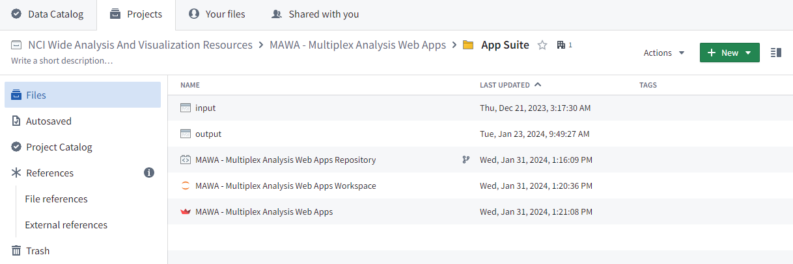

# MAWA Workflow: Getting Started
## Setting up the Suite
Making sure the app is set up and accessible within your own group's project is one of the first steps required to use MAWA. At present the only way to really achieve this is to have a member of DMAP (Dante or Andrew), configure the app to be used in your project space. Once this is set up, follow these steps to use your data in MAWA.
## Configuring the Suite
When MAWA has been set up in your project, you will see a a set of folders and files that compromise of the following:
* **An input dataset**: This dataset is where you should place your data files to be loaded by MAWA. 
* **An output dataset**: This dataset is where you can expect to find the data files you have created while using MAWA
* **The MAWA code repository**: This object contains the code responsible for creating MAWA. It is our hope that you will never need to directly open and interact with this object
* **The MAWA code workspace**: This object contains the actual suite of apps that are  described in this documentation. This is where we invite you to use the apps, run analyses, and generate results.

These objects should look like this in the NIDAP window

## Starting MAWA

You will need to access your project's NIDAP space at times in order to add your data, or retrieve your results, but for the most part you will access MAWA itself by following the link provided to you when DMAP set up the environment. To start the using MAWA follow the following instructions:
 
1. Click on the following URL to open MAWA. It should look like this: 

2. Select the button at the bottom of the screen that says Termina

3. At the cursor, type the command: ./run.sh

4. At the top of the page click on the button that says dashboards

5. In the new panel that opens, click on the button that says Preview in the middle container labeled ‘Streamlit’

6. In the preview window that opens, click on the text in the side panel that reads: ‘Open app in New Tab’
