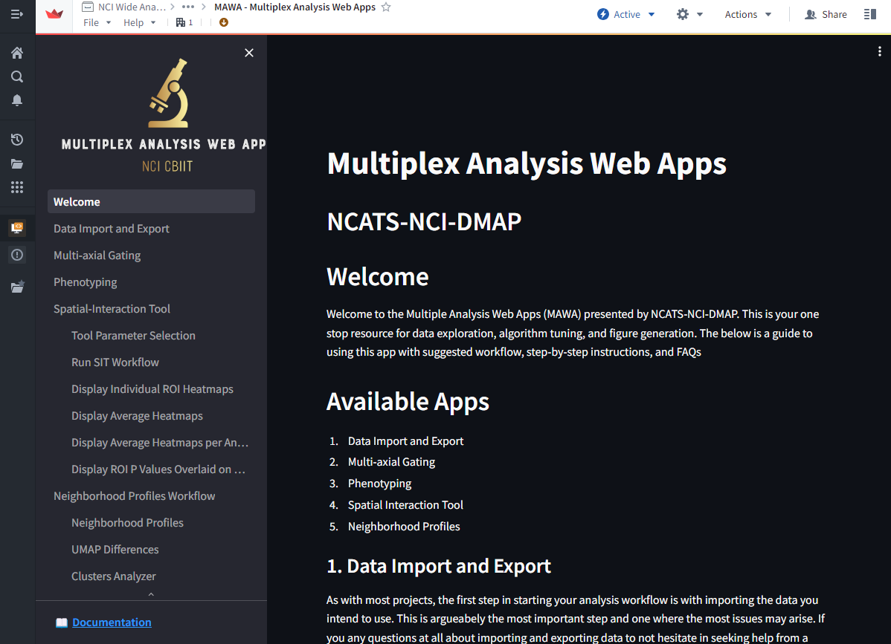

# MAWA Workflow: Getting Started
## Setting up the Suite
Making sure the app is set up and accessible within your own group's project is one of the first steps required to use MAWA. At present the only way to really achieve this is to have a member of DMAP (Dante or Andrew), configure the app to be used in your project space. Once this is set up, follow these steps to use your data in MAWA.
## Configuring the Suite
When MAWA has been set up in your project, you will see a a set of folders and files that compromise of the following:
* **An input dataset**: This dataset is where you should place your data files to be loaded by MAWA. 
* **An output dataset**: This dataset is where you can expect to find the data files you have created while using MAWA.
* **The MAWA code repository**: This object contains the code responsible for creating MAWA. It is our hope that you will never need to directly open and interact with this object.
* **The MAWA code workspace**: This object contains the environment where the developers perform testing on the suite of apps. This was previously how users accessed MAWA. At present, it is our hope that users will never need to directly open and interact with this object.
* **The MAWA Streamlit Dashboard**: This object is the actual dashboard used to access MAWA. This will allow you to use all the tools described in this documentation. At any point we share a link to MAWA, we will be sharing a link to this NIDAP object located in your organization's project.

These objects should look like this in the NIDAP window

## Starting MAWA

You will need to access your project's NIDAP space at times in order to add your own data, or retrieve your own results, but for the most part you will access MAWA itself by following the link provided to you when DMAP set up the environment. To start the using MAWA follow the following instructions:
 
1. Click on the following URL to open MAWA. It should start by looking like this: 

And after loading it will look like this:

And that's all that is required to load MAWA!

## Versions and Updating

On occasion, MAWA will be updated with new features and bug fixes. Please take special care to observe the version you are using. You can identify the version of the app you are using by finding the blue checkbox in the top banner with the V# next to it. You might also see a warning banner that prompts you to update to the latest version. To update to the latest version of MAWA either (1) select the Restart link in the banner or (2) select the latest version number from the dropdown menu when you select the blue version number in the header. See below for examples.

WARNING: Resetting your your MAWA version will lose all your current analysis progress. Only reset to a new version after you have saved your work!

