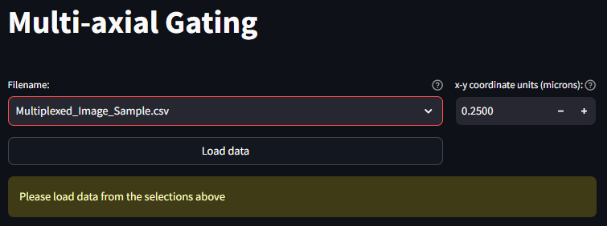
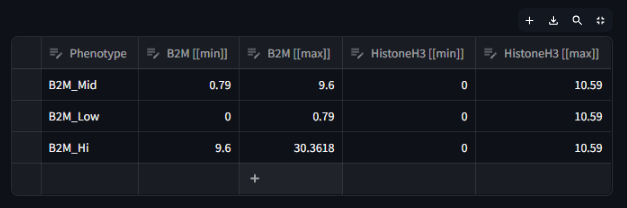
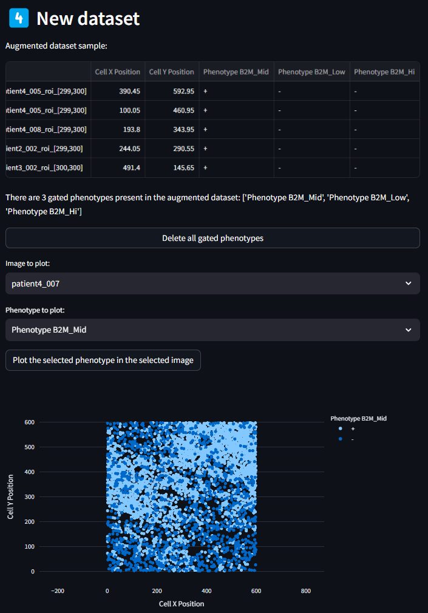

# Multi-axial Gating

Setting and tuning the thresholded levels of marker intensities from your Multiplex recordings is a great opportunity to delve into the ways different florescence levels can impact your analysis outcomes. MAWA aims to give you fine control over your marker combinations (phenotypes). The multi-axial gating app is the place to start.

## Load your dataset
After importing your dataset in the `Data Import and Export`, you should be able to see a list of all imported datasets in a select box next to a button that says **Load Data**. Once you have navigated to the correct dataset, press the **Load Data** button to load this dataset into memory. 

## Full App Loads
Once the data is loaded, the full `Multi-axial Gating` app is revealed to be the following four sections
1. Column Filtering
1. Current Phenotype
1. Phenotype Assignments
1. New Dataset

## 1. Column Filtering
The Column Filtering panel is the first place to begin identifying the feature or features that will make up your sub-phenotypes. All columns present in the dataset are populated in this select box. Selecting any one feature plots the range of values in the histogram below. For continuous variables such as florescence intensity, the histogram is smoothed using a kernel density estimation (KDE). For categorical variables, there is no smoothing. Above the plot is a range slider, which when first loaded is set to the min and maximum values of the histogram. By moving each end of the range slide, you can set a new range of values to consider a given variable. The histogram will update the selected legend entry based on the values of the range slider. Once you have selected a target range for a variable, click the button below titled *Add Column Filter to current phenotype*. This will create an entry in the next section, Current Phenotype, with the selected marker and the range of values selected. Once a marker is added to the Current Phenotype section, it is no longer selectable in the Column Filter select box. If at any point you want to re-select a range for a given phenotype, this can be done in the next step. 

## 2. Current Phenotype
A given phenotype can be made up of multiple marker ranges, but only one instance of each marker. As marker ranges are selected in the Column Filter step, they populate in the table describing the Current Phenotype. Each field of this dataframe is editable, so if you would like to more precisely tune the threshold values for min and max, value that is possible to do. If a whole row has become unnecessary for the current Phenotype definition, you can select the cell to the left of the row, and click the delete button in the top right of the dataframe. If at any point, you want to completely start over the current phenotype definition, you can do so by clicking the *Reset Data Editor* button.

Once the list of markers and their ranges has been selected, you can name the phenotype in the text box labeled Phenotype name. After naming the phenotype, click the *Add phenotype to assignments table* button. After doing so the table in this section will clear, and the table in the next section 'Phenotype Assignments' will populate with the name of the newly customized phenotype, and the marker min and max values used to define the phenotype. In addition, after adding the new phenotype definition to the Phenotype Assignments table, the list of Features in the Column Filter drop down box will repopulate with all available column names from the original dataset. 

Repeat the above instructions in Sections 1. and 2. as many times as are required for your study definitions. Once all phenotypes have been defined, move on to section 3.

## 3. Phenotype Assignments
Once a phenotype is defined in Section 2, they will be added to the Phenotype Assignments table in Section 3. The table details the name of each phenotype in the first column, and the subsequent columns are the min and max values of the markers listed for a given phenotypes. Like the previous table, each cell is editable if finer grain control is desired. If there is a need to reset the whole table, this can be done by clicking the *Reset data editor* button. 

Once the Assigned Phenotype definitions table is complete, it is time to integrate it back into the input dataset. This is done by clicking the *Generate new dataset from the phenotype assignments* button.

As can be seen in the first image below, the number of columns that are generated after assigning phenotypes can make the table very long and hard to read. In order to view all columns, you can use the scroll bar or expand the dataframe using the expand icon in the top right of the table. The expanded view will look like the second image.

## 4. New Dataset

Once the new dataset has been generated, columns will be appended to the original dataset with the phenotypes that were generated in the previous step. By scrolling all the way to the end of the dataframe shown in this section, you can see new columns with the new assigned phenotype names. Each cell (row) in the dataset will now also have an entry of '+' or '-' for a given assigned phenotype, denoting if it matches the phenotype criteria.

If there is a need to quickly preview some of these Assigned Phenotypes, that can be done using the utility below the New Dataset table.

From here, the next step is to load this New Dataset in the `Phenotyping` Tab. Navigate to the `Phenotyping` page in the app for the next step.

## Custom Naming of Phenotype Combinations

The `phenotyping` documentation site can provide more detail about the overall use and goals for the `Phenotyping` page, but it has an important connection with the `multi-axial gating`. In addition to a *Load Data* button at the top of the page, there is also a *Load Multi-axial Gating Data* button, which loads the New Dataset dataframe that was produced in the last step of the `Multi-axial Gating` page. 

Once the *Load Multi-axial Gating Data* button is pressed, the normal phenotyping elements are populated, including the Phenotypes Assignments Table, Phenotype Summary Table, and the Phenotyping Scatterplot. You will notice in the Phenotype Assignments table that the species names assigned use the phenotypes from the `Mutli-axial Gating` as markers. This distinction is confusing, and it something that we hope to smooth out in the future. Our ultimate hope is that using this page is another opportunity to assign names to your phenotypes, especially when there is overlap with the phenotyping conditions. 