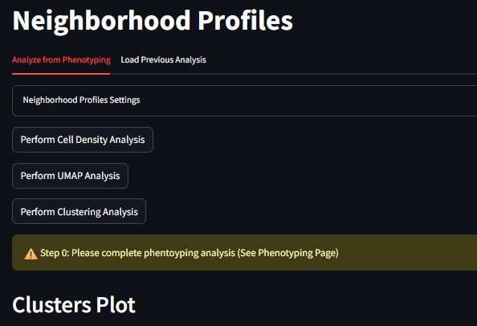
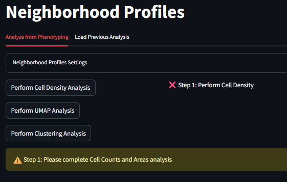
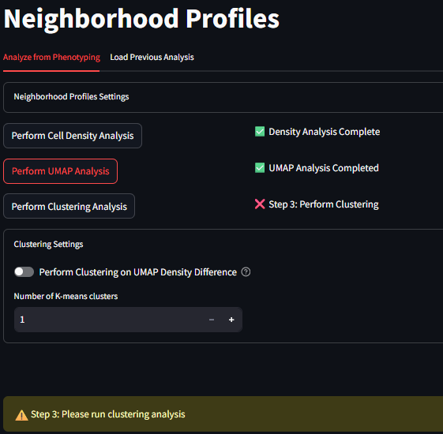

# Neighborhood Profiles Workflow

## Introduction and Theory

Neighborhood Profiles identifies the types of cells that often cluster with one another, and find patterns of these types of clusterings occurring more often in certain tissue types or health-conditions. This goal of these analyses is to help identify the specific neighborhoods present in a given dataset, and characterize their makeup based on the phenotypes present.

## Workflow

The Neighborhood Profiles Workflow can be used once your data has been properly loaded and phenotyped. Of particular importance is that the your data contains X/Y coordinates for each cell, and each cell is categorized as a phenotype in the phenotyping page.

### Neighborhood Profiles

This page is the starting point for running the Neighborhood Profiles. On the top of this page you will see options for running each step of the analysis. At the bottom of the page are placeholder spaces for two figures.

In the top panel, there are the following buttons

* Perform Cell Counts/Areas Analysis
* Perform UMAP Analysis
* Perform Clustering Analysis

The bottom figure panels are labeled

* Clusters Plot
* Neighborhood Profiles

#### Instructions for Use

1. Start by checking the message text that can be seen in the middle of the screen. If you have not completed the previous phenotyping step, this message will appear as the following.

2. If you have finished the phenotying step, the middle message text should look like the following. This means the app is ready to be used for processing Neighborhood Profiles.

3. Begin the Cell Counts/Area Analysis by clicking the button at the top of the page. This process will take varying amounts on time depending on the size of your dataset, the size of your images, and the number of phenotypes you have selected in the phenotyping step. For a dataset of 48k cells, and 8 phenotypes, this process takes approximately 5min. When this step has completed correctly, you will see a message in the middle of the screen that reads as the following:

4. Next, begin the UMAP Analysis by clicking the button at the top of the page. Running the UMAP decomposition will take varying amounts on time depending on the size of your dataset, the size of your images, and the number of phenotypes you have selected in the phenotyping step. For a dataset of 48k cells, and 8 phenotypes, this process takes approximately 1 min. When this step has completed correctly, you will see a message in the middle of the screen that reads as the following:

5. Finally, we can begin the process of clustering the results of the UMAP. At the lower part of the analysis section, select a number of clusters to use for the k-means clustering algorithm. Once a number is selected, click on the button to *Perform Clustering Analysis*. This step is the fastest, and depending on the number of cells in your datasets, this should take under 1 min to run. When its complete, the user should see be able to see the scatter below populated and colored by cluster, and the Neighborhood Profiles line plots populated and drawn for the phenotypes included in each cluster.

6. In the clusters figure, observe that any time you can swap back and forth between plot the colors of the scatter plot by the Cluster label or by the Phenotype label. You can also progress through all the images that are included in your dataset and see how the clusters have partitioned individual tissues samples

7. In the Neighborhood Profiles Line plot, the user can observe the make up (profiles) of each of the clusters (neighborhoods) created by the K-means clustering algorithm. These line plots show the density measurement of the number of cells for a given phenotype (counts /mm2) within different annuli surrounding the cells of that given cluster. The user can swap between different clusters by selecting them from the drop down menu. All figures are scaled to fit on the same axes, and as such any one phenotype from any one cluster might contribute more to the overall scale of these line plots. As is often case, there are many cells (often the majority) that are assigned to the 'Other' phenotype. When this other category dwarfs the other phenotypes, it might be helpful to hide the 'Other' phenotype from the figure. This can be done in the Options menu seen in the second image below. This action can be similarly done for the 'No Cluster' cluster if that has been created in your workflow. As you test differences in your UMAP results as a factor of the k-means cluster size, your Neighborhood Profiles line plots will change, giving the user an opportunity to tune and test their assumptions of the data.

### UMAP Differences

UMAP Differences if the next step in your Neighborhood Profiles analysis pipeline. After the UMAP decomposition is completed, and the clustering has completed, this page will offer further down-stream analsyses to consider. While there are not many levers and knobs to change the data implicitly here, the user can generate different figures based other outcome variables from the input dataset, and the phenotypes that were defined earlier in the MAWA workflow.

Before starting to view these Clustering Differences, you must complete at least the UMAP processing seen on the previous page. To experience the full offering on this page, the user will also want to complete the Clustering step on the Neighborhood Profiles page. There are warnings on the page to help you remember what needs to be completed in order to see each figure.

The Figures that are available for viewing are:

1. `Full 2D density UMAP`  
1. `2D UMAP density filtered by Features and Phenotypes`  
1. `Difference UMAP filtered by Features and Phenotypes (Both density and clustered)`  

#### Full 2D UMAP

This is purely the outcome of UMAP decomposition colored by density of cells. This is meant to be a template to compare to, after the other UMAP permutations are generated, both within this study design as well as for future reproducibility.

#### 2D UMAP filtered by lineage and features

This is a copy of the UMAP on the left, but with additional filtering options. Specifically, this allows you adjust which cells from your dataset contribute to which parts of the UMAP. Filtering by a specific phenotype will show the parts of the UMAP that include that phenotype. If instead the user filters by a Feature of the dataset(AlivePatient or Nucleus size for examples), then again the UMAP will filter by the data that for that feature. At any time, the user can swap between viewing the density UMAP and the clustered UMAP to evaluate different information. Additionally if at any time you want to look at Markers vs Phenotypes, that option is also available.

#### Differnce UMAP scaled by features

These are again further copies of the 2D UMAP. These are displayed by default both as denisty and clustered, side by side. These difference UMAPs aim to show you This give you options to check differences between feature conditions. At this time, this works best with Boolean data (True/False), but also works with range data (x>0, x<0).

### Clusters Analyzer

The final option offered for downstream analysis is clustering analysis. Again, this page will be mose useful after the UMAP decomposition is completed, and the clustering has completed. The Cluster Analyzer page contains two figures generated from the upstream data analysis:

1. `Cluster/Phenotype Heatmap`  
1. `Incidence Line Plot`  

These figures have been created to investigate the composition of phenotypes of cells in assigned clusters, and the feature expression of cells in assigned clusters. Once a given figure is generated, you can change the name of the output in the text below each and add it as a figure to be exported in the Data Input and Output Page. The following sections are some general information about each figure:

#### Cluster/Phenotype Heatmap

The heatmap offers a view of the number of each phenotyped cell located within each cluster. It offers three normalization options for viewing the heatmap:

1. `No Norm`: No normalization is applied to the heatmap. The relative colors for each cell is scaled for all cells in all phenotypes in all clusters. If you were to sum the numbers shown in the grid, they would sum to the total number of cells fit to the spatial-umap model.
2. `Norm within Clusters`: The grid values are decimal values of the number of cells within a cluster assigned to a given phenotype. In this schema, the relative color of the grid is based on the within-cluster distribution.
3. `Norm within Phenotypes`: The grid values are decimal values of the number of cells within a phenotype assigned to a given cluster. In this schema, the relative color of the grid is based on the within-phenotype distribution.

#### Incidence Line Plot

The incidence line plot details how the cells within each cluster differ in their expression of the data features recorded alongside the cell positions and marker values. These features range from boolean values (True/False), continuous values (-1, 0, 1), and string values('time0'). There are two selection boxes to augment the indicence line plot, and a radio button to select the type of comparison to perform. They are the following:

`Feature Select Box`: Features that can be considered for the Incidence line plot.

* Cell Counts: The number of cells assigned to a given cluster
* HYPOXIC, NORMOXIC, NucArea, RelOrientation, etc: Columns from your dataset by which you want to directly compare TWO conditions. At this time, this works best with Boolean data (True/False), but also works with range data (x>0, x<0). Once a feature is selected, the incidence plot no longer shows a pure count, but instead a comparison of the two conditions within the feature.

`Phenotype Select Box`: The phenotype the cells being plotted. The options shown are:

* All Phenotypes: Shows all cells irrespective of phenotype
* VIM+, ECAD+, VIM+ECAD+, Other, etc...: Shows only the cells that express for the specifically chosen phenotype (created during the Phenotyping stage of the workflow).

`Display-as Radio Button`: How the values of the Feature select box should be displayed. This radio button is disabled for the Cell Counts condition, but is enabled for any other Feature selection. The options to be displayed are:

* Count Differences: The value shown on the y-axis is the difference between the number of cells in a cluster in the Y>0 condition subtracted from the number of cells in that cluster in the Y<0 condition.
* Percentages: The value shown on the y-axis is the percentage of cells that match a feature condition in that given cluster. The Sum of the values across a given cluster would be to 100%.
* Ratios: The value shown on the y-axis is the ratio of r1/r0 where r1 is the percentage of cells that match the feature of condition shown on y>0 in that cluster, and r0 is the percentage of cells that match the feature of the condition show on y<0 in that cluster.
