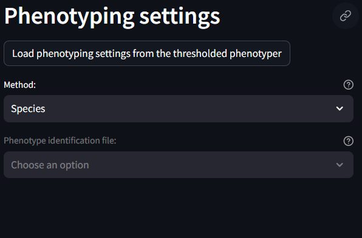
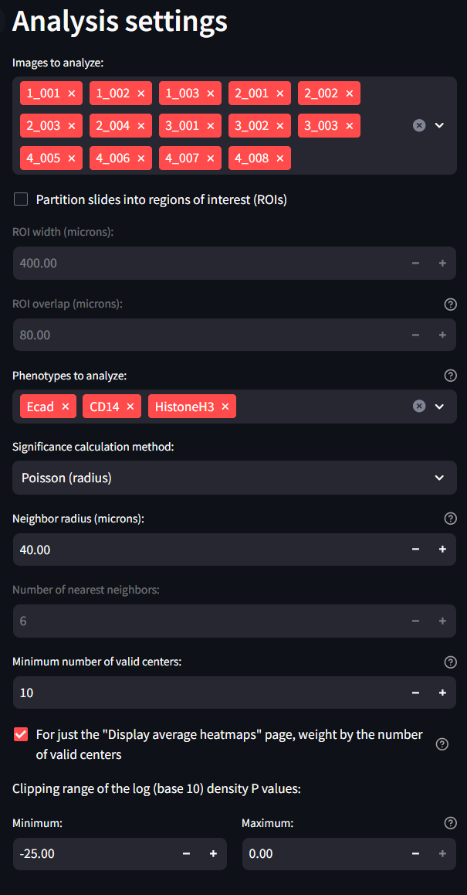

# Spatial Interaction Tool (SIT)

## Introduction and Theory

The Spatial Interaction Tool (SIT) is a method of identifying if the arragangement of cells and cell types in a Region of Interest (ROI) are part of a random distribution or are somehow more ordered; either aggregrated significantly or dispersed significantly.

This analysis performs this tasks by first identifying the average density of cells within an ROI. A poisson distribution of possible densities is derived centered on this average distribution. Then the density of cells is calculated for each cell in the ROI. Based on how that density falls on the ROI-average density poisson distribution, a cell is said to have below or above average density. The degree to which they have have below or above average density is measured by left p-value and the right p-value. These left and right p-values help to describe if this cell is part of groupings that are generally more aggregated or more dispersed. To make things further descriptive, this per-cell density is measured on a per-phenotype basis...that is a separate measure of density is measured for each cell of a given phenotype in the ROI. In that way, not only can SIT give the us a sense of aggregations and dispersions, but also which species are most aggregated or morst dispersed. As a result, we receive left and right p-values for each of the phenotype combinations.

The combined set of left and right p-values are then described by heatmaps to better understand which phenotyped cells appear to aggregate together or disperse from each other. These heatmaps are first collected on an ROI basis, but are then aggregated over whole images, and then eventually across images.

## Workflow

The Spatial Interaction Tool (SIT) can be utilized once a dataset has been loaded, and phenotypes have been assigned to each cell in your dataset. The first place to visit for your SIT workflow is the Tool Parameter Selection page.

### Tool Parameter Selection

This is the first page in the SIT workflow and the most important when it comes to identifying how the data should be interpreted by the SIT.

#### Phenotyping Settings

This section identifies and applies the phenotyping labels. The easiest and best thing to do here is to load the phenotyping settings that were previously generated on the previous phenotyping page. This can be done by clicking the button that says

#### Analysis Settings

This section identifies specific anaylsis settings to be used during the SIT.

* Images to Analyze: Select which images to include in the analysis.
* Partitition slides into regions of interests: Check this setting if you have ROI labels set in your dataset. If so, the SIT which split your images into smaller ROIs. If unchecked, the SIT will use the whole image as the ROI.
* ROI Width (microns): Width of the ROIs
* ROI Overlap (microns): Overlap of the ROIs
* Phenotypes to Analyze: Select which phenotypes to analyze. This should be taken from the previous phenotyping step.
* Significant Calculation Method: How to determine the aggregation/dispersion metrics. Poisson is suggested
* Neighbor radius (microns): Radius around a given cell to check for neighboring cells.
* Number of nearest neighbors: Minimum number of required neighbors to be considered part of a larger population
* Minimum number of valid centers: Minimum number of required centers for an ROI to be considered to have clusters of cells.
* Weight by number of valid centers: Toggle whether or not to normalize the denisty values by the number of valid centers
* Clipping range of the log (base 10) density P Values: Check with Andrew on this one.

#### Annotation settings

Finally, the annotation settings section is meant to offer input from a previously created annotations file. If you do not have any annotation file associated with your dataset, feel free to ignore these settings. They will not otherwise impact your analysis. If you do have an annotation file, first make sure it is loaded into the MAWA File Handling section. Annotations with the correct suffix will appear in the drop down list and can be loaded into memory when selected. Each of the other settings are for your own preference.

#### Apply Settings Button

Once all setting decisions are made, there is a button at the very bottom of the page that saves the current settings for the SIT workflow. This ensures that when moving on to future steps, that any possible changes or update to the settings is concretely saved an clear manner. If at any point changes are made to settings within the Tool Parameter Selection, the user must push this button at the bottom to overwrite previously set settings. Similarly, once new settings are applied using this settings button, all downstream results, figures, and tables will be reset and removed. This is to ensure whichever settings are set by this button are the same settings that are used to produced the output results.

### Run SIT Workflow

This page is the second page to visit when setting up SIT. Once the settings are set on the previous page, this workflow page will allow the user to identify which parts of the analysis to run.

From within this page you can see the following settings:

Tool Components for running Analysis

* **Instantiate TIME Class**: Default. Should always remained checked
* **Plot ROIs**: Default. Should always remained checked
* **Calculate P values**: Default. Should always remainded checked
* **Check Metrics, impose plotting settings and convert to numpy format**: Default. Should always remainded checked
* **Plot desnity heatmaps per ROI**: Default. Should always remainded checked
* **Plot ROI outlines individually on the whole slides**: Default. Should always remainded checked
* **Average density P values over ROIS for each slide**: Default. Should always remainded checked
* **Average Density P values over TOIs for each annotation Region Type**: Will only be available if an annotation file is present. Check to produce figures of this type.
* **Plot density P values for each ROI over slide spatial plot**: Check to produce figures of this type.

Job Execution Parameters:

* **Should we use multiple logical CPUS to speed up calculations?**: Default. Should always remainded checked
* **Select number of threads for calculations**: Default. Keep this number at 7.

After selecting the settings you would like to perform, proceed by clicking the Run workflow button. Running the SIT workflow takes roughly 10min on a dataset of 48k cells and 8 phenotypes. Once this has completed running, the user can view their results in the following pages.

### Display Individual ROI Heatmaps

The Individual ROI Heatmaps page is your first opportunity to see the results of the SIT. Click through each ROI and image by using the drop down menu and increment widget.

### Display Average Heatmaps

This page shows the average ROI heatmaps. In the case of this example, the full image is one large ROI, so these will look identical to the heatmaps in the previous page. You can manipulate and explore the data with the same widgets as the previous example.

### Display Average Heatmaps per Annotations

This page produces very similar results to the previous page, but takes into account any previous identified annotations. See the step in the Tool Parameter Selection about including annotations with your workflow.

### Display ROI P Values Overlaid on Slides

This final SIT page helps to identify which cells scattered in a given image, have the significant conditions of aggregation or dispersal. This is particular useful to compare with other phenotyped iamges of the samples so that future diagnosis of medical conditions can be recognized as disease states based on spatial patterns. In this example, there is only one ROI per image, so the information is slighly less informative. The user can manipulate these images by swapping the image being shown, a center species to observe and a neighbor species to observe.

