# End-to-End Spatial Interaction Workflow
{: .no_toc }

## Table of contents
{: .no_toc .text-delta }

1. TOC
{:toc}

---

This two-part tutorial outlines some recommended steps for using MAWA to (1) perform manual phenotyping on a CSV file containing multiplex intensities for one or more images and (2) obtain measures of the degrees to which cells of the defined phenotypes are interacting. This could be used for correlating with response variables to detect biomarkers. For example, one could say that in image A, for which a patient survived a cancer, their M2 macrophages interacted heavily with CD8 T cells, whereas in image B, corresponding to a patient who died, their M2 macrophages generally repelled away from CD8 T cells.

## Part I: Manual Phenotyping Using Multiaxial Gating

### Step 1: Load a sample multiplex datafile into MAWA's Code Workspace

When you start MAWA (by clicking on the link or file sent to you by the admins) you should see this:

Click on the "Data Import and Export" page,

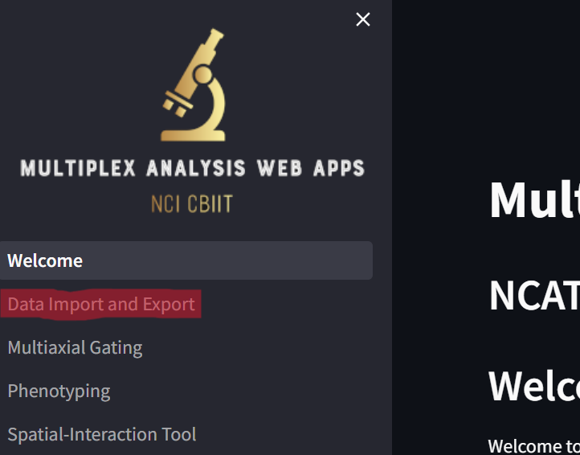

loading a page that looks like this:

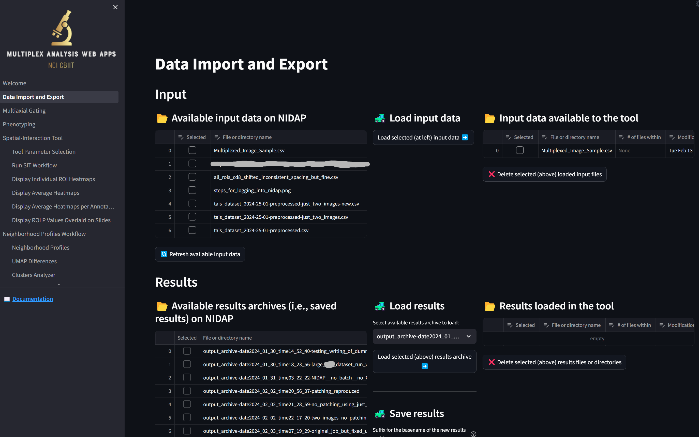

Load the sample dataset by clicking the checkbox next to "Multiplexed_Image_Sample.csv" in the "Available input data on NIDAP" section and clicking the button "Load selected (at left) input data",

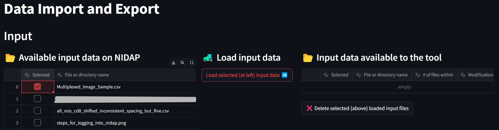

resulting in the file being loaded from NIDAP's main filesystem to the Code Workspace:

This datafile is now ready to be processed by the MAWA app suite in the Code Workspace.

### Step 2: Load the sample multiplex datafile into the multiaxial gater app

Click on the "Multiaxial Gating" page,

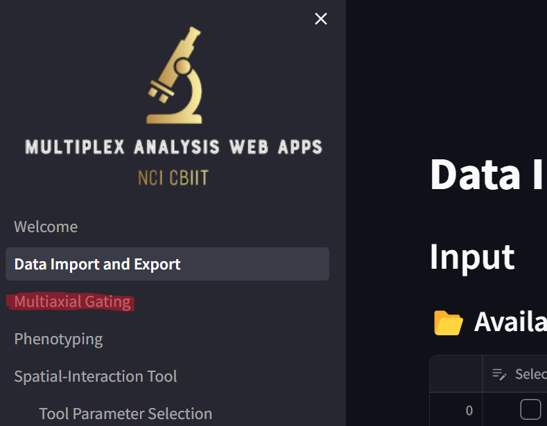

loading a page that looks like this:

Note that the file you just imported into the app, "Multiplexed_Image_Sample.csv", is availble in the "Filename" field. Since the coordinates in this file are already in microns, change the "x-y coordinate units (microns)" value to 1 by selecting what's in the box and typing "1", and if you wish, turn on the switch labeled "Perform batch normalization", which transforms the values in each numeric column in each image to a Z score. Then click the "Load data" button,

loading a page that looks like this:

---

### Step 3: Build a phenotype by gating on multiple intensity channels

Select a column corresponding to an intensity channel in the "Column for filtering" dropdown, say, CD16:

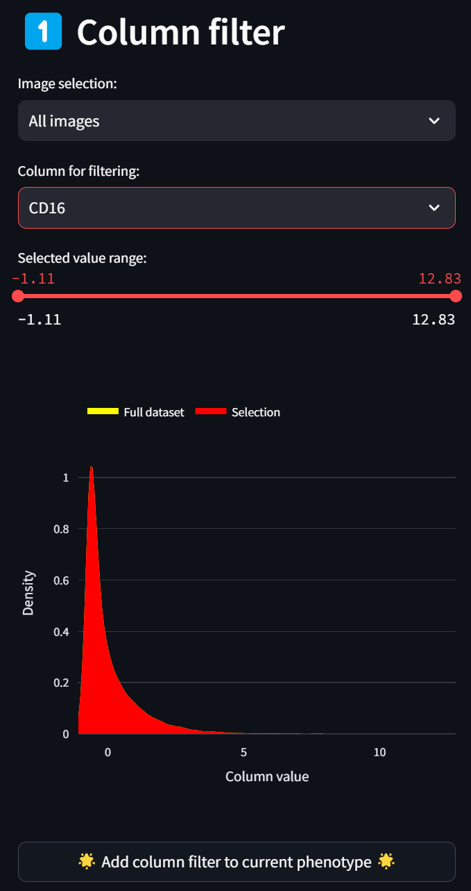

☝️ ***Tip:** As for all dropdown menus, you can easily search for a column name by clicking on the dropdown and immediately typing in the name (case-insensitive).*

A histogram (smoothed by a kernel density estimate) of the distribution of Z scores over the CD16 column for all images (since "All images" is selected in the "Image selection" field) is displayed in red. To select only a subset of intensities, limit the selected range by adjusting either end of the double-ended slider in the "Selected value range" field. For example, to limit the selection to cells with CD16 intensity values that are at least 1.5 standard deviations above the mean, move the left end of the slider to about 1.5, and click on the "Add column filter to current phenotype" button,

leading to this:

You'll see the "Column filter" you just created gets added to the "Current phenotype" that you are in the process of defining. The CD16 column in the "Column filter" section disappears as an option because it has already been added to the current phenotype, resulting in the "Column for filtering" selection to reset to the first numeric column in the dataset.

Note that you can refine ranges at any point by double clicking in the "Minimum value" or "Maximum value" columns in the "Current phenotype" table and editing the bound using the keyboard. For example, here we can refine "1.51" to "1.5", hitting Enter to finalize the edit:

As a cell phenotype can be defined by thresholding multiple fields, we can filter on additional columns in the dataset to define a phenotype. (E.g., one may want to set a lower bound on the DAPI channel in order to be confident that the object in the dataset has a sufficient nucleus to be a real cell.) Let's do this by adding a filter for low PDL1 expression by selecting PDL1 in the "Column for filtering" dropdown and setting the maximum bound to 0:

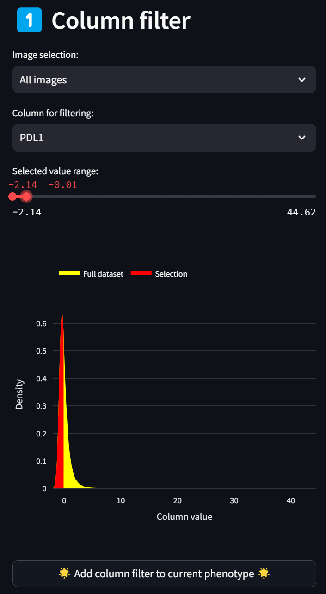

Hit the "Add column filter to current phenotype" button and update the maximum bound value if you didn't get it quite right with the slider:

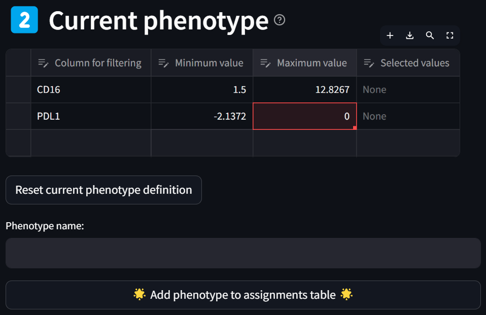

Now enter a name for the phenotype in the "Phenotype name" box and click the "Add phenotype to assignments table" button,

leading to this:

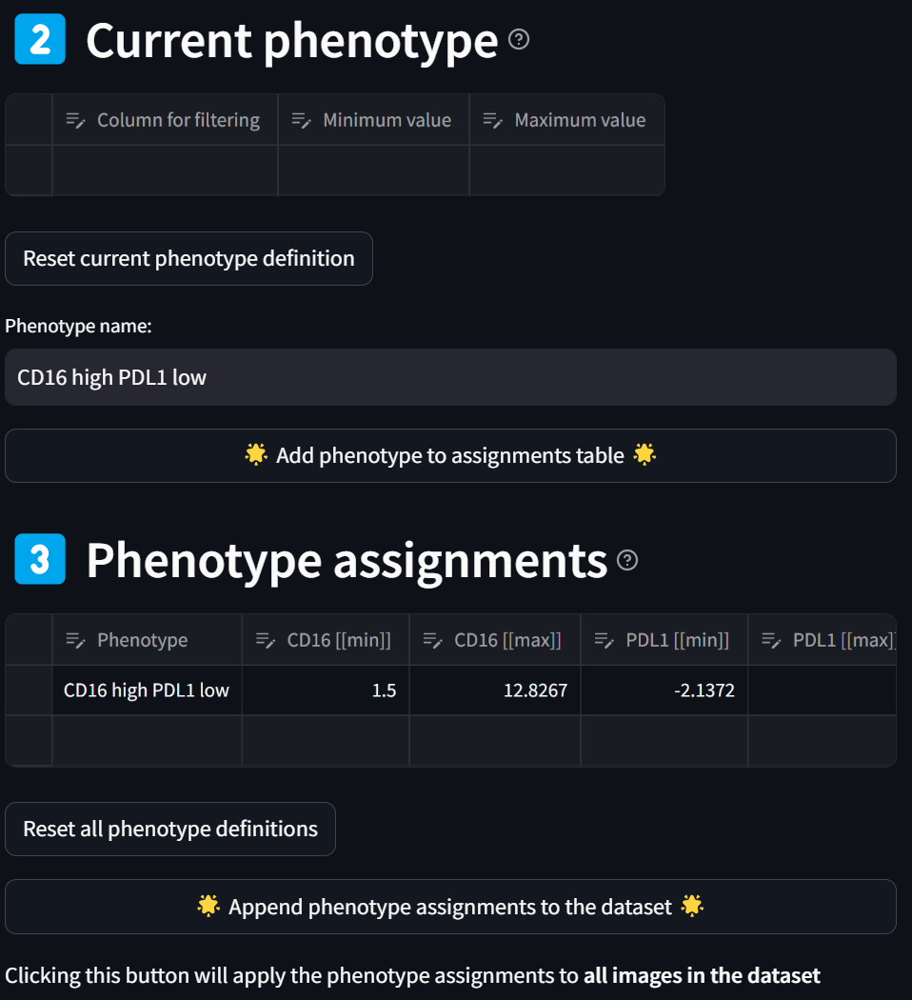

You have now defined the "CD16 high PDL1 low" phenotype as can be seen in the "Phenotype assignments" section. Note you can further modify your phenotype criteria by editing the values in the table, as done previously.

### Step 4: Add additional phenotypes

Now add two more phenotypes in the same manner, adding one or more column filters to the table in the "Current phenotype" section, and when you're done defining each phenotype, assigning a name to the phenotype and pressing the "Add phenotype to assignments table" button to transfer it to the full gating table in the "Phenotype assignments" section. Define the following phenotypes:

☝️ ***Tip:** You can view a large image of the phenotype assignments table (gating table) by clicking on the "maximize" icon that appears at the top right of the table when hoving your mouse over it:*

### Step 5: Generate the defined phenotypes, adding them to the dataset

Click the "Append phenotype assignments to the dataset" button to generate the phenotypes specified in the "Phenotype assignments" table:

Note that the sample of the dataset that's always displayed in the "New dataset" section now has three new phenotype columns appended to the end:

### Step 6: Visualize the new phenotypes

Select an image and phenotype to plot in the "Image to plot" and "Phenotype to plot" fields, respectively, and click on the "Plot the selected phenotype in the selected image" button to display a corresponding scatterplot:

☝️ ***Tip:** The displayed scatterplot is fully interactive (zoom, pan, etc.). Double click on it to reset to the original view.*

### Step 7: Resolve any phenotype conflicts

Generally, the phenotypes you define will be mutually exlusive because it is useful for a cell to be described by one and only one phenotype. If a single cell is described by more than one phenotype, you should refine your phenotype definitions until the cells in your dataset are uniquely defined by them. However, there will often be cases in which this cannot be done precisely.

For example, say that you defined the "X low" phenotype as having the Z score range [-10, 0.1] in the "X" column and the "X high" phenotype as having the Z score range [0.0, 15]. You would then expect some cells to be both "X low" positive and "X high" positive. This is generally a bit nonsensical and refers to the small population of cells having "X" column Z scores in beween 0.0 and 0.1.

Instead of refining your phenotype definition, you may wish to simply say "Define all 'X low' positive and 'X high' positive cells as 'X high' only (i.e., not 'X low' as well)." This can be addressed in this step of the workflow.

In the three phenotype definitions specified above, we do not have any cells that fall into this category. But, we still did not ensure that all our phenotype definitions were mutually exclusive. While the first two phenotypes "CD16 high PDL1 low" and "CD16 high PDL1 high" *are* mutually exclusive, we made no effort to ensure that the third phenotype "Ecad mid" is different from the first two. Indeed, 7.5% of the cells in the dataset are both "Ecad mid" and either of the first two phenotypes. This can also be addressed in this step of the workflow, as will now be demonstrated.

☝️ ***Tip:** There may be situations in which you want cells to be labeled with multiple phenotypes, and this is a highly supported feature: Simply perform subsequent phenotyping in the "Phenotyping" app using the "species" phenotyping method. Instead, below you will use the "Custom" phenotyping method to re-assign such compound phenotypes.*

Click on the "Phenotyping" page,

and on the page that loads, click on the "Load Multiaxial Gating Data" button:

In the "Choose a Phenotyping Method" box, select "Custom" and click the "Apply Phenotyping Method" button:

The table in the "Phenotype Assignments" section now looks like:

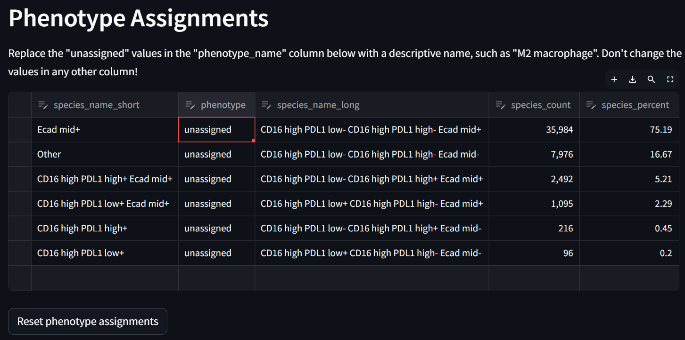

Double click in each row in the "phenotype" column to potentially re-assign compound phenotypes with your keyboard. For example:

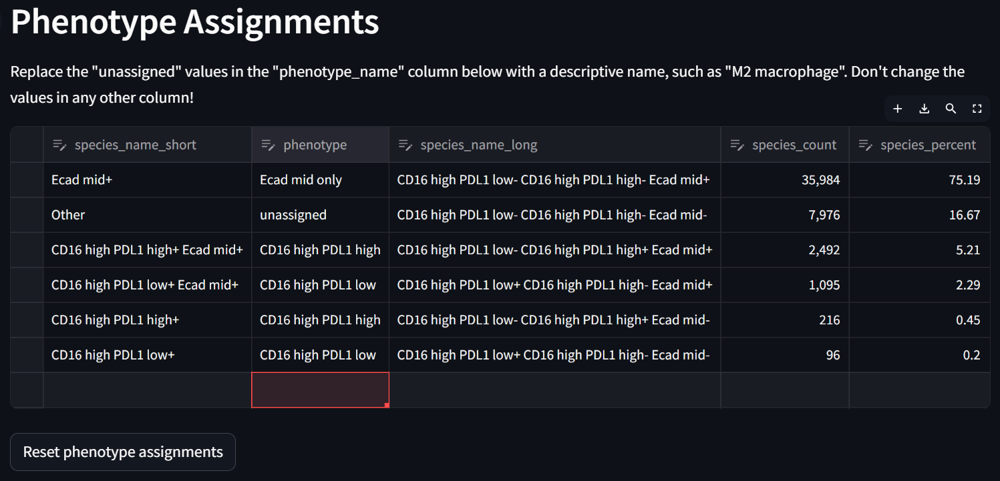

☝️ ***Tip:** There is no need to assign a "phenotype" to every row in the "Phenotype Assignments" table. The downstream spatial analysis apps will (in different ways) exclude phenotypes labeled "unassigned", as the Spatial Interaction Tool does when it loads the settings from the Phenotyping app and "Custom" phenotyping is selected.*

Note that the "Phenotype Summary" table below and the "Phenotype Plot" to the left get dynamically updated as phenotype assignments are made.

## Part II: Assessing Cell Interactions Using the Spatial Interaction Tool

### Step 1: Load the new phenotypes and phenotyping refinement into the SIT

Click on the "Tool Parameter Selection" page,

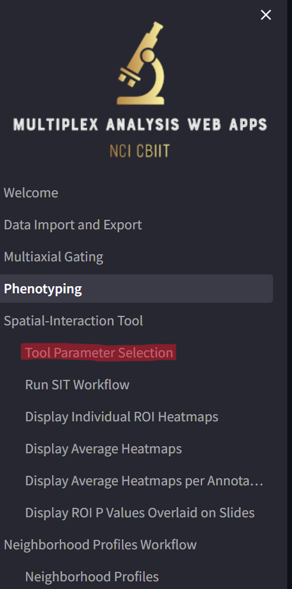

and on the page that loads, click on the "Load relevant settings from Phenotyper" button:

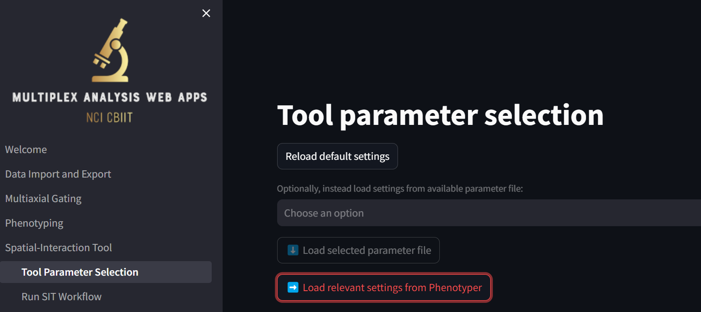

The loaded settings now look like:

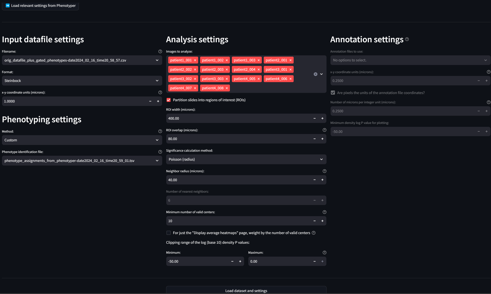

This action created two files: (1) a datafile called "orig_datafile_plus_gated_phenotypes-date2024_02_16_time20_58_57.csv" that is the original datafile with the new phenotypes from the Multiaxial Gater appended to it, and (2) a new "phenotype identification file" called "phenotyping_assignments_from_phenotyper-date2024_02_16_time20_59_01.tsv" that contains the refinements we made in the Phenotyper to the new phenotypes.

In addition, it loaded relevant settings into the "Input datafile settings", "Phenotyping settings," and "Analysis settings" sections of the page.

### Step 2: Modify the default analysis settings

Now make three modifications in the "Analysis settings" section:

1. Uncheck the "Partition slides into regions of interest (ROIs)" checkbox. This is because the sample dataset contains single ROIs instead of whole slides so there is no need to further partition the data.
1. Reduce the "Minimum niumber of valid centers" setting to 1. This will exclude fewer ROIs, if any, from the analysis.
1. In the subsection "Clipping range of the log (base 10) density P values," change the "Minimum" field to -20 to more clearly observe small interactions in the heatmap:

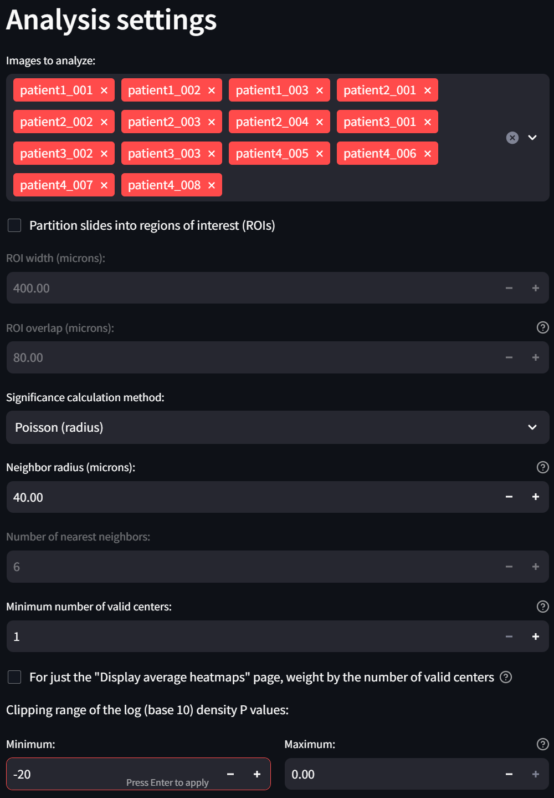

### Step 3: Load the dataset and settings

Now click the "Load dataset and settings" button:

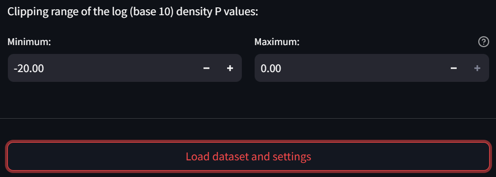

Once the dataset has been loaded, you will see a temporary "Dataset loaded" message show up in the bottom right corner of the window. Further, a '⚠️' character will show up on the button you just clicked, which indicates that if you click the button again (which at this point is completely fine), the directory containing workflow checkpoints will be overwritten.

### Step 4: Run the Spatial Interaction Tool (SIT)

Now click on the "Run SIT Workflow" page,

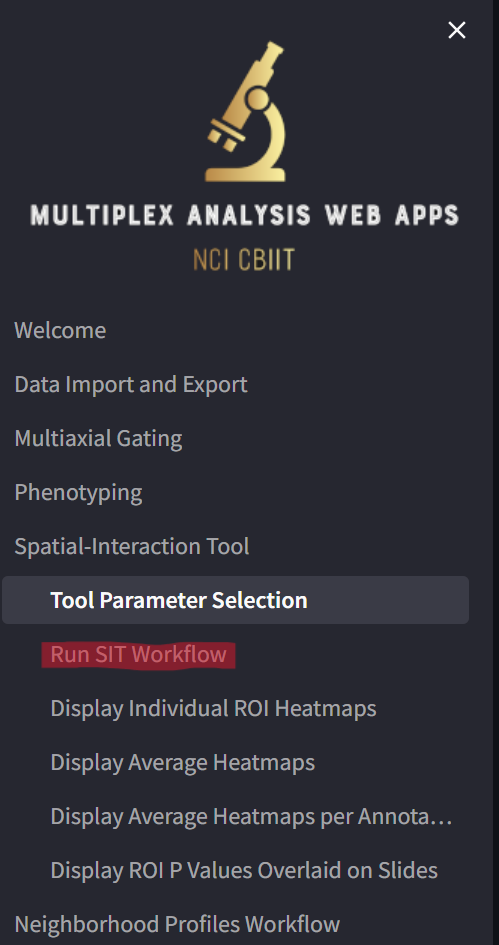

loading a page that looks like this:

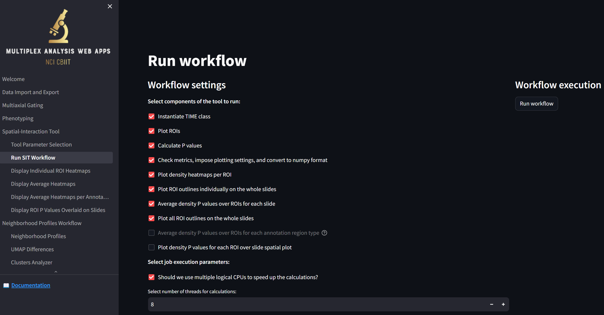

It's best to leave the default settings checked for now; these are the settings that will allow the following two pages ("Display Individual ROI Heatmaps" and "Display Average Heatmaps") to be populated to visualize the calculated interactions between the defined cell phenotypes.

Press the "Run workflow" button to start the analysis:

The entire workflow will take about a minute to run and will display an output like:

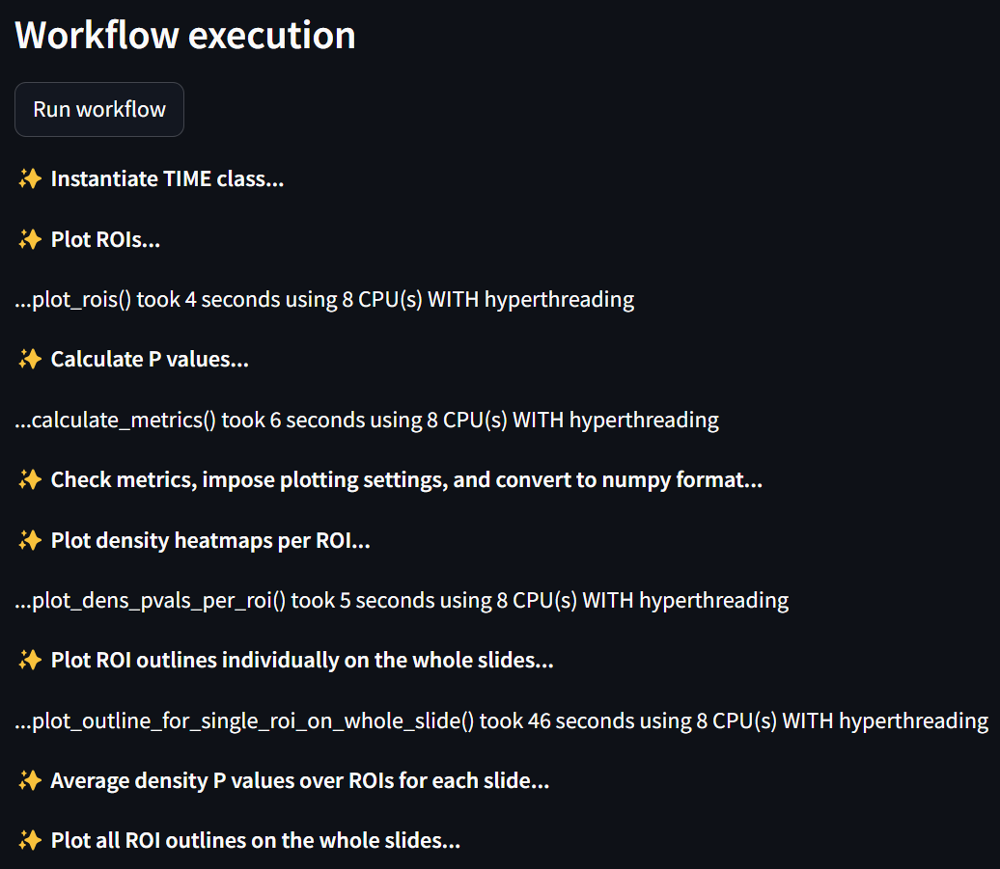

### Step 5: Visualize the cell interactions for each ROI

To visualize the results, start by clicking on the "Display Individual ROI Heatmaps" page,

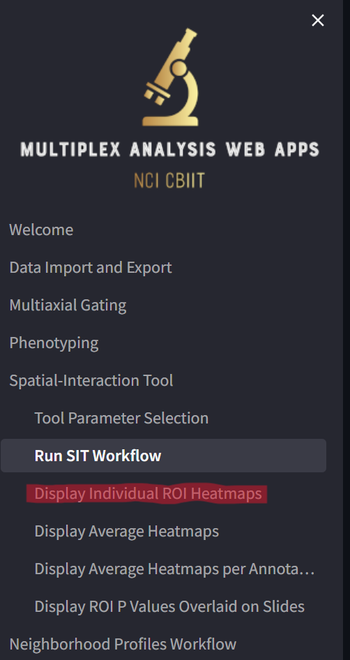

loading a page that looks like this:

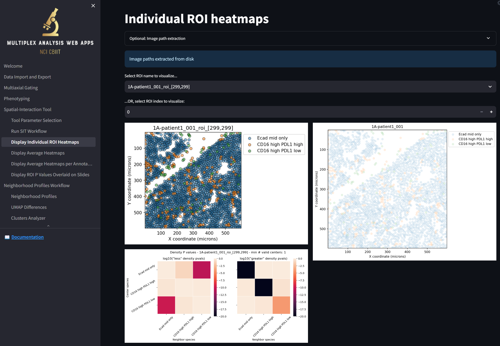

Some notes:

* Note that right off the bat, the magenta-colored squares in the heatmap in the bottom left indicate that "Ecad mid only" and "CD16 high PDL1 low" cells tend to repel away from each other when compared to random distributions of the two cell types in space. The two black cells (and one orange cell) in the heatmap to the right indicate that "Ecad mid only" and "CD16 high PDL1 high" (and, to a lesser extent, "CD16 high PDL1 low") tend to aggregate around themselves (though not each other). The rest of the squares in the heatmaps indicate insignificant levels of repulsion or aggregation between cell types when compared to random distributions of the cells in space.
* Note you can select which ROI to display by choosing from the "Select ROI name to visualize..." dropdown or by stepping through them by clicking on the "+" or "-" in the "...OR, select ROI index to visualize" field.
* In this sample dataset, there is one ROI per slide. This is because this is how the dataset came and because we deselected the "Partition slides into regions of interest (ROIs)" checkbox. If there were multiple ROIs per slide, the rightmost image would depict a composite of all the ROIs in the slide, where the currently selected ROI would be highlighted by a black border.

### Step 6: Visualize the cell interactions for each slide averaged over its ROIs

Click on the "Display Average Heatmaps" page,

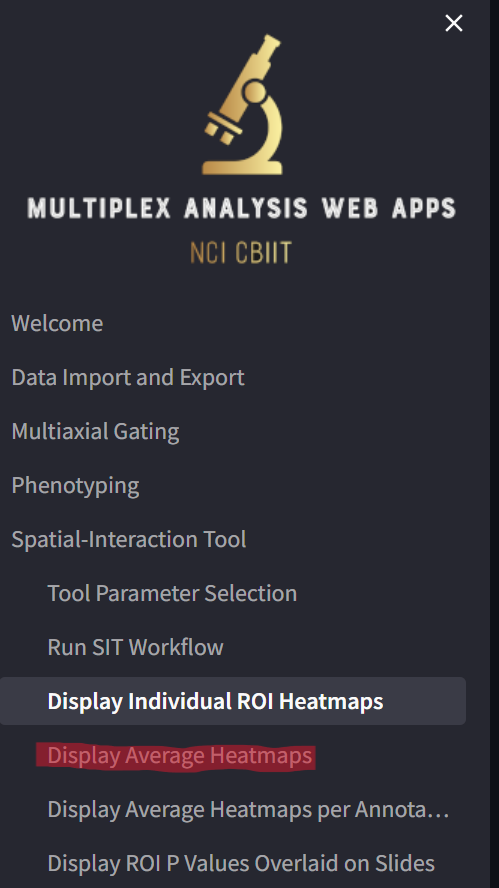

loading a page that looks like this:

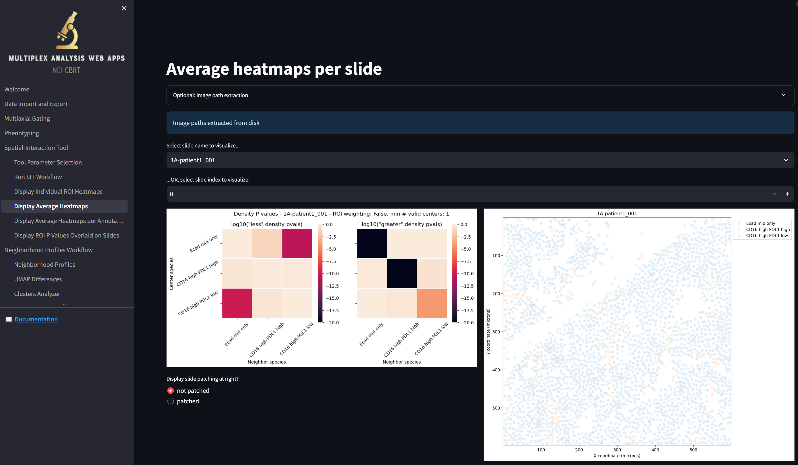

Some notes:

* As noted previously, in this sample dataset, there is one ROI per slide. Had their been multiple ROIs per slide, the displayed heatmap would be averaged over the heatmaps for all ROIs in each slide. In this current case, the average heatmap is the same as the heatmap for the single ROI. The cell scatterplot on the right would again be a composite of all the ROIs in the slide, with all the ROI borders displayed in black depending on whether the "Display slide patching at right?" is set to "not patched" or "patched".
* Similar to before, you can select which slide to display by choosing from the "Select slide name to visualize..." dropdown or by stepping through them by clicking on the "+" or "-" in the "...OR, select slide index to visualize" field.

### Step 7: Save the results

To save all your work so you can later run additional analyses or re-visualize the results using the web interface, click on the "Data Import and Export" page, which now looks something like this:

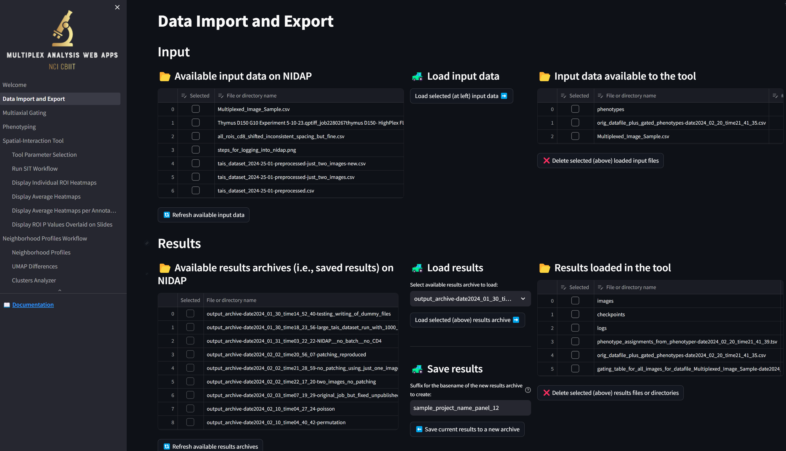

We see that, unlike at the beginning of this tutorial, the table in the "Results loaded in the tool" section is now populated with the files that were generated. The "gating_table_for_all_images_for_datafile_Multiplexed_Image_Sample-date2024..." file was generated by the Multiaxial Gater and the rest of the files and directories were generated by the Spatial Interaction Tool.

To save all these results securely to NIDAP, enter a suffix in the "Suffix for the basename of the new results archive to create" field such as "gating_through_sit_on_Multiplexed_Image_Sample" and click the "Save current results to a new archive" button:

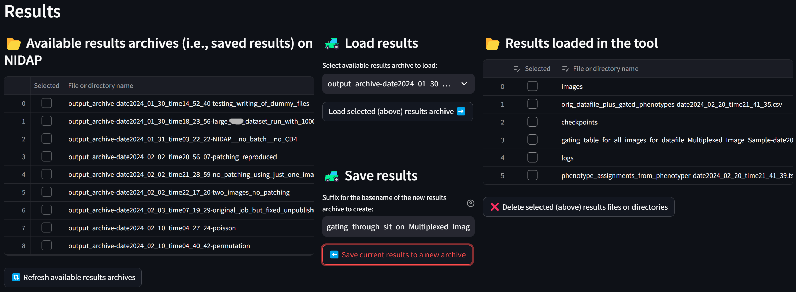

If you press the "Refresh available results archives" button, you will see that the new archive has been created:

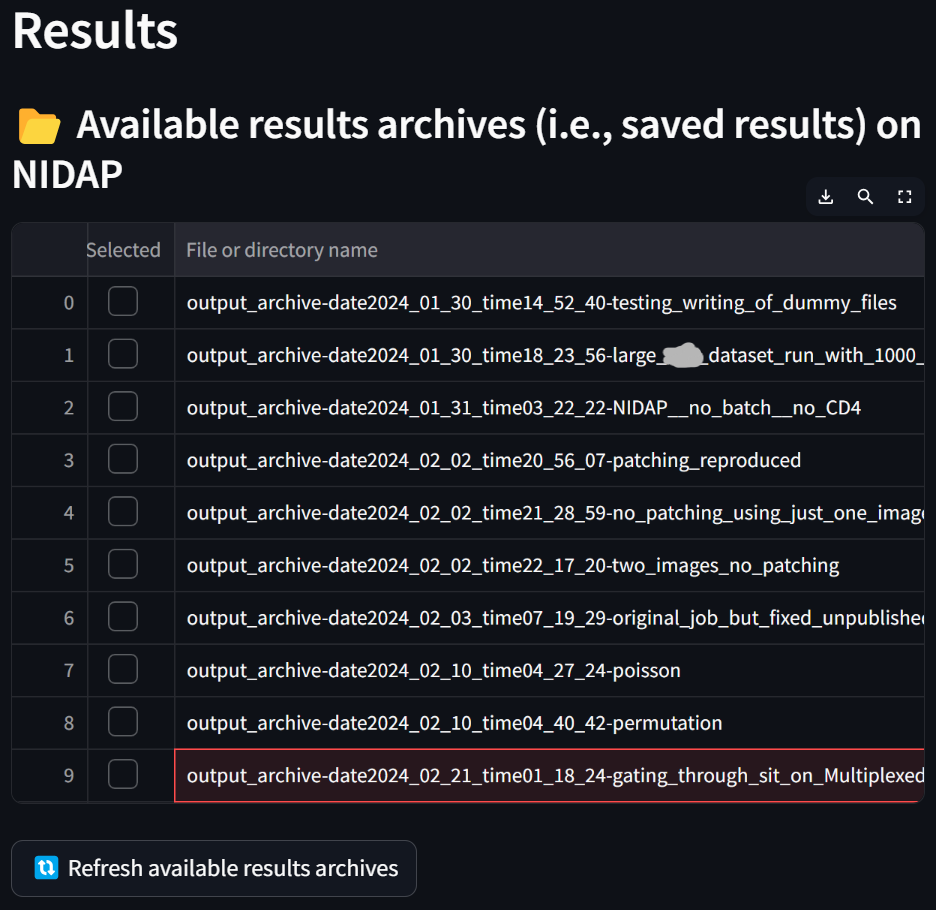

The next time you start MAWA, you can optionally load this archive by selecting it in the "Select available results archive to load" dropdown, clicking the "Load selected (above) results archive" button, and then pressing the Load button in the App Session Management section of the left sidebar, allowing  you to, e.g., resume analysis with the SIT or visualize its results using the web interface. In the meantime, it will be safely stored on NIDAP.

## What's next?

This tutorial has shown you how to perform manual phenotyping on a CSV file containing multiplex intensities and obtain measures of the degrees to which cells of the defined phenotypes are interacting.

Next, you may want to:

* Try out the workflow above on your own dataset, replacing "Multiplexed_Image_Sample.csv" with the name of your own datafile.
* For slides that could be partitioned into ROIs, check the "Partition slides into regions of interest (ROIs)" checkbox in the "Analysis settings" section of the SIT settings. Use a ROI width of 800 or 1000 microns for testing the workflow, or use widths of 400 or even 200 microns for production jobs. Keep in mind that the smaller the ROI width, the more ROIs will be generated and the longer the workflow will take to run.
* Note also that values of down to -50 in the "Minimum" field of the "Clipping range of the log (base 10) density P values" section of the SIT settings are more typical. The larger the value (i.e., closer to zero), the more interactions will be visualized in the heatmaps. The value of -20 was used here to more clearly observe small interactions.
* Check the "Plot density P values for each ROI over slide spatial plot" checkbox in the SIT workflow settings in order to generate images of the whole slides with its ROIs colored by the log of the P value for a selected pair of cell types (accessed on the "Display ROI P Values Overlaid on Slides" page). While this is a useful visualization, it can lengthen the runtime of the workflow.
* [Reach out](mailto:andrew.weisman@nih.gov) to us to get more advice on how to use MAWA to perform spatial analysis on your multiplex data!
